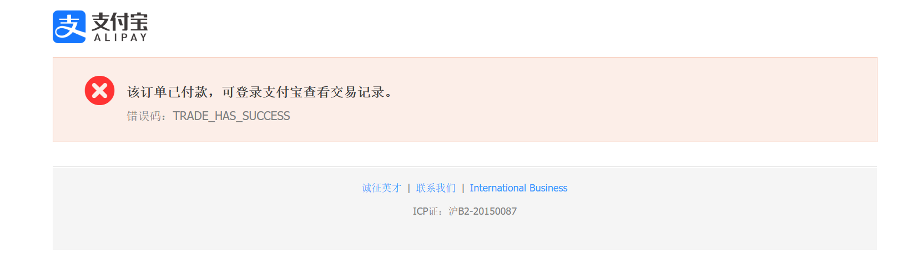

# Restaurant-payment 餐饮和支付系统

一个基于 Spring Boot 3 + Vue 3 的全栈餐饮订单和支付系统，前后端分离架构。spring AI作为单独服务接入，通过周围人菜品识别对应菜单。提供完整的用户端和管理端功能，支持菜品管理、套餐管理、订单处理、支付集成、实时通信等核心能力。

------

# 后端说明

```
* 订单状态：
* 1 待支付：下单未付款
* 2 待商家接单：已付款，商家还没接单
* 3 商家接单，制作中：商家确认接单，正在做菜
* 4 待骑手取餐：商家出餐完成，骑手还没到店
* 5 骑手已取餐，配送中：骑手拿到餐，在路上，实时看定位
* 6 骑手已送达：骑手点送达，等待用户确认
* 7 订单已完成：系统自动确认收货
* 8 订单已取消：未接单退款、商家拒单、超时取消、售后全额退款
```

**支付流程**：

| 集成到order  |  |
| ------------ | -------------------------------------- |
| 支付过程     |  |
| 同步支付成功 |  |
| 异步检验     |  |

------

# 项目结构

```
restaurant-payment/
├── backend-spring-restaurant/        # 后端代码
├── database-sql/                     # 数据库脚本目录
│   ├── sql.txt                       # 数据库初始化SQL
│   └── 数据库设计文档.md               # 完整的数据库设计说明
├── frontend-vue-admin-restaurant/   # 前端管理端（Vue 3）
└── 说明/                             # 项目说明文档
    ├── 原型功能/                      # 前端原型截图
    ├── 支付功能结果/                   # 支付流程截图
    ├── postman测试          # postman测试文档
    ├── 用户端接口.html       # 用户端API接口文档
    └── 管理端接口.html       # 管理端API接口文档
```

# 环境要求

- JDK 17+
- Spring Boot 3+
- Node.js 20.19.0+ 或 22.12.0+
- MySQL 8.0+
- Redis 7.0+
- Maven 3.8+

---


## 一、用户与员工认证模块

### 需求阶段

**需求背景**：项目需要双端认证系统，支持用户端（消费者）和管理端（员工/管理员）的登录、注册、权限控制。

**痛点**：
- 用户和管理员需要独立的认证体系和权限管理
- 分布式环境下 Session 共享困难
- 需要支持单点登录和 Token 过期失效
- 密码明文存储不安全

### 设计阶段

**设计思路**：

Q：为什么用户端和管理端使用两套独立的 JWT 配置？
> A：用户和管理员的业务场景不同，Token 有效期、密钥、权限校验逻辑都需要独立配置。使用两套 JWT 配置可以更好地控制双端的认证策略，避免互相影响。

Q：为什么不用 Session 而用 JWT？
> A：Session 需要在服务端维护会话状态，集群部署时需要 Session 共享。JWT 是无状态的，Token 本身携带用户信息，服务端只需要验证签名即可，更适合分布式架构。

**架构设计**：
```
用户请求 → JwtTokenUserInterceptor → JwtUtil校验Token → Controller → Service → Mapper → MySQL
         					↓
             		 Redis（存储Token）
管理员请求 → JwtTokenAdminInterceptor → JwtUtil校验Token → Controller → Service → Mapper → MySQL
                     	 	↓
            		  Redis（存储Token）
```

### 编码阶段

**策略流程图**：

```java
用户登录 → UserController/login() → 校验用户名密码 → 生成JWT Token（用户端密钥）→ Redis存储 → 返回Token
管理员登录 → AdminEmployeeController/login() → 校验用户名密码 → 生成JWT Token（管理端密钥）→ Redis存储 → 返回Token
请求拦截 → JwtTokenUserInterceptor/JwtTokenAdminInterceptor → 校验Token → 刷新有效期 → 放行请求
```

**核心代码**：

```java
// 用户端登录（双端独立JWT配置）
String token = JwtUtil.createJWT(jwtProperties.getUserSecretKey(), jwtProperties.getUserTtl(), claims);
stringRedisTemplate.opsForValue().set(KEY_PREFIX + user.getId(), token, jwtProperties.getUserTtl(), TimeUnit.SECONDS);
```

### 问题修复阶段

**问题**：双端拦截器路径配置冲突

**修复方案**：在 WebMVCConfiguration 中为用户端和管理端配置独立的拦截器，通过路径前缀区分（`/user/**` 和 `/admin/**`）

---

## 二、菜品管理模块

### 需求阶段

**需求背景**：需要支持菜品的 CRUD 操作，菜品信息包含口味等关联数据，查询频率高。

**痛点**：
- 菜品查询频繁，需要缓存优化
- 菜品与口味是一对多关系，查询时需要关联查询
- 菜品上下架状态需要实时更新
- 缓存与数据库一致性问题

### 设计阶段

**设计思路**：

Q：为什么用手动 Redis 缓存而不是 Spring Cache 注解？
> A：手动控制 Redis 操作更灵活，可以自定义缓存策略、处理空值缓存、精确控制缓存失效时机。菜品查询需要关联口味数据，手动缓存可以一次性缓存完整的 DishVO 对象。

Q：菜品缓存为什么设置 30 分钟过期时间？
> A：菜品信息相对稳定，不会频繁变更。30 分钟的过期时间可以有效减少数据库查询压力，同时在菜品更新时主动删除缓存保证数据一致性。

**缓存策略流程图**：
```
查询菜品
    ↓
缓存存在？
    ├─ 是 → 直接返回缓存数据（DishVO包含口味信息）
    └─ 否 → 查询数据库（菜品+口味）→ 设置缓存→ 返回数据

更新/删除菜品 → 主动删除缓存
```

### 编码阶段

**策略流程图**：

```java
查询菜品 → AdminDishController/{id} → Redis查询缓存
    ├─ 缓存存在 → 直接返回缓存数据（DishVO含口味）
    └─ 缓存不存在 → MySQL查询菜品+口味 → 组装DishVO → 设置Redis缓存（30分钟）→ 返回数据
更新菜品 → AdminDishController/put → 更新MySQL菜品+口味 → 删除Redis缓存 → 返回结果
删除菜品 → AdminDishController/delete → 校验状态（仅停售可删）→ 删除MySQL → 删除Redis缓存 → 返回结果
```

**核心代码**：

```java
// AdminDishController.java - 菜品缓存查询（30分钟过期）
String key = DISH_CACHE_KEY + id;
Object cached = redisTemplate.opsForValue().get(key);
if (cached instanceof DishVO dishVO) {
    return Result.success(dishVO);
}
// 缓存未命中，查询数据库并设置缓存
redisTemplate.opsForValue().set(key, dishVO, EXISTS_TIME, TimeUnit.MINUTES);
```

### 问题修复阶段

**问题**：已启用的菜品无法删除

**修复方案**：在删除前检查菜品状态，只有停售状态的菜品才能删除

```java
@DeleteMapping
public Result deleteDish(@RequestParam List<Long> ids) {
    LambdaQueryWrapper<Dish> queryWrapper = new LambdaQueryWrapper<>();
    queryWrapper.in(Dish::getId, ids).eq(Dish::getStatus, StatusConstant.ENABLE);
    List<Dish> dishList = dishService.list(queryWrapper);
    if (!dishList.isEmpty()) {
        return Result.error("不能删除已启用的菜品");
    }
    // 删除菜品口味和缓存...
}
```

---

## 三、套餐管理模块

### 需求阶段

**需求背景**：套餐是多个菜品的组合，需要支持套餐的创建、查询、上下架和删除。

**痛点**：
- 套餐与菜品是多对多关系，需要中间表维护
- 套餐查询频率高，需要缓存优化
- 套餐状态变更需要同步更新缓存

### 设计阶段

**设计思路**：

Q：为什么套餐用 Spring Cache 注解而菜品用手动 Redis？
> A：套餐查询逻辑相对简单，使用 `@Cacheable` 和 `@CacheEvict` 注解可以减少样板代码。套餐数据量相对较小，注解方式足够灵活。而菜品查询需要关联口味数据，手动控制可以更好地处理复杂的缓存逻辑。

Q：套餐删除时为什么用 `allEntries = true` 清除所有缓存？
> A：套餐删除可能影响多个缓存条目（套餐详情、套餐列表等），使用 `allEntries = true` 可以确保所有相关缓存都被清除，避免数据不一致。

**架构设计**：
```
查询套餐 → @Cacheable → Redis缓存 → 返回数据
添加/更新/删除套餐 → @CacheEvict → 删除缓存
```

### 编码阶段

**策略流程图**：

```java
添加套餐 → AdminSetmealController/post → 校验名称唯一性 → MySQL保存套餐+套餐菜品关联 → @CacheEvict清除所有缓存 → 返回结果
查询套餐 → AdminSetmealController/{id} → @Cacheable缓存查询 → Redis缓存命中返回 → 未命中查询MySQL → 返回结果
更新套餐 → AdminSetmealController/put → 更新MySQL → @CacheEvict清除缓存 → 返回结果
上下架套餐 → AdminSetmealController/status → 更新状态 → @CacheEvict清除单个缓存 → 返回结果
```

**核心代码**：

```java
// AdminSetmealController.java - Spring Cache注解缓存
@GetMapping("/{id}")
@Cacheable(cacheNames = "setmeal", key = "#id")
public Result readSetmeal(@PathVariable Long id) {
    Setmeal setmeal = setmealService.getById(id);
    // 关联查询套餐包含的菜品
    LambdaQueryWrapper<SetmealDish> wrapper = new LambdaQueryWrapper<>();
    wrapper.eq(SetmealDish::getSetmealId, id);
    return Result.success(setmealDishService.list(wrapper));
}
```

### 问题修复阶段

**问题**：套餐状态变更后缓存未更新

**修复方案**：使用 `@CacheEvict` 注解在状态变更时清除对应缓存

```java
@PutMapping("/{id}/status/{status}")
@CacheEvict(cacheNames = "setmeal", key = "#id")
public Result updateStatus(@PathVariable Long id, @PathVariable Long status) {
    Setmeal setmeal = Setmeal.builder().id(id).status(status).build();
    setmealService.updateById(setmeal);
    return Result.success(id + "::" + (status == StatusConstant.ENABLE ? "启用成功" : "停用成功"));
}
```

---

## 四、购物车模块

### 需求阶段

**需求背景**：用户在下单前需要将菜品或套餐加入购物车，支持数量调整和清空操作。

**痛点**：
- 同一用户同一菜品同一口味需要去重
- 购物车数据需要实时更新金额
- 需要区分菜品和套餐的处理逻辑

### 设计阶段

**设计思路**：

Q：为什么购物车不用 Redis 缓存？
> A：购物车数据属于用户会话数据，每个用户的购物车内容不同，且数据量较小。直接存储在数据库可以保证数据持久化，避免用户重新登录后购物车数据丢失。

Q：购物车去重逻辑为什么要同时匹配用户ID、菜品ID和口味？
> A：同一菜品的不同口味是不同的商品（比如"麻辣火锅"和"清汤火锅"），需要作为独立的购物车条目处理。只匹配用户ID和菜品ID会导致不同口味的菜品被合并，不符合业务需求。

**架构设计**：
```
添加商品 → 判断是菜品还是套餐 → 检查是否已存在（同用户+同商品+同口味）
    ├─ 已存在 → 更新数量和金额
    └─ 不存在 → 新增购物车记录
```

### 编码阶段

**策略流程图**：

```java
添加购物车 → UserShoppingCartController/post → 判断菜品/套餐 → 去重查询（userId+dishId+dishFlavor）
    ├─ 已存在 → 更新数量和金额（BigDecimal计算）→ 返回结果
    └─ 不存在 → 新增购物车记录 → 返回结果
查询购物车列表 → UserShoppingCartController/list → MySQL按userId查询 → 返回购物车列表
清空购物车 → UserShoppingCartController/delete/all → MySQL删除用户所有记录 → 返回结果
```

**核心代码**：

```java
// UserShoppingCartController.java - 购物车去重逻辑（同用户+同菜品+同口味）
LambdaQueryWrapper<ShoppingCart> wrapper = new LambdaQueryWrapper<>();
wrapper.eq(ShoppingCart::getUserId, userId)
        .eq(ShoppingCart::getDishId, dishId)
        .eq(ShoppingCart::getDishFlavor, dishFlavor);
ShoppingCart sameCart = shoppingCartService.getOne(wrapper);
```

### 问题修复阶段

**问题**：购物车金额计算精度丢失

**修复方案**：使用 BigDecimal 进行金额计算，避免浮点数精度问题

---

## 五、订单与支付模块

### 需求阶段

**需求背景**：实现完整的订单流程，包括下单、支付、接单、配送、完成等状态流转，支持支付宝支付和退款。

**痛点**：

- 订单状态流转复杂，需要严格控制状态转换
- 支付回调需要处理异步通知
- 退款需要与支付平台交互
- 需要支持订单重复提交

### 设计阶段

**设计思路**：

Q：为什么订单状态用枚举类管理？
> A：订单状态是有限且固定的集合，使用枚举类可以避免魔法数字，提高代码可读性和可维护性。枚举类还可以封装状态转换逻辑。

Q：为什么支付成功后需要更新订单状态？
> A：支付是订单流程的关键节点，支付成功后订单状态从"待支付"变为"待商家接单"，触发后续的业务流程。

**订单状态流转**：
```
1 待支付 → 2 待商家接单 → 3 制作中 → 4 待骑手取餐 → 5 配送中 → 6 已送达 → 7 已完成
        	↓                                      
   8 已取消（未接单退款、商家拒单，售后全额退款）
```

### 编码阶段

**策略流程图**：

```java
用户下单 → UserOrderController/submit → 设置状态为待支付 → MySQL保存订单+订单明细 → 返回订单ID
发起支付 → UserOrderController/pay → 更新状态为待商家接单 → 构建支付宝表单 → 返回支付页面
同步回调 → AlipayController/return → 验签 → 返回支付成功页面
异步通知 → AlipayController/notify → 验签 → 校验金额 → 更新订单状态 → 返回成功
取消订单 → UserOrderController/cancel → 更新状态为已取消 → 调用支付宝退款 → 返回结果
```

**核心代码**：

```java
// UserOrderController.java - 下单与支付流程
orders.setStatus(OrderStatusEnum.PENDING_PAYMENT);  // 待支付
orderService.save(orders);
// ...保存订单明细...

// 支付时更新状态
payOrder.setStatus(OrderStatusEnum.PENDING_MERCHANT_ACCEPT);  // 待商家接单
payOrder.setPayMethod(1L);  // 1=支付宝
orderService.updateById(payOrder);
```

### 问题修复阶段

**问题**：订单取消后无法退款

**修复方案**：在取消订单时调用支付宝退款接口

```java
@PutMapping("/cancel/{id}")
public Result cancelOrder(@PathVariable Long id) {
    Orders orders = orderService.getById(id);
    orders.setStatus(OrderStatusEnum.CANCELLED);
    orders.setCancelReason("用户取消");
    orderService.updateById(orders);
    
    // 调用支付宝退款接口
    try {
        RefundDTO refundDTO = new RefundDTO(
                orders.getId().toString(),
                orders.getAmount(),
                LocalDateTime.now().toString(),
                orders.getCancelReason()
        );
        alipayService.refund(refundDTO);
    } catch (AlipayApiException e) {
        throw new RuntimeException(e);
    }
    return Result.success("cancelOrder" + id);
}
```

---

## 六、WebSocket 实时通信模块

### 需求阶段

**需求背景**：实现订单状态实时推送，用户可以实时查看订单进度，商家可以实时接收新订单通知。

**痛点**：
- 轮询方式效率低，服务器压力大
- 需要支持多客户端同时在线
- 连接断开后需要重新连接

### 设计阶段

**设计思路**：

Q：为什么用 WebSocket 而不是轮询？
> A：轮询需要客户端定时发送请求，效率低且浪费资源。WebSocket 是长连接，服务器可以主动推送消息，实时性更好，服务器压力更小。

Q：为什么用 Map 存储 Session？
> A：需要根据用户 ID 定向推送消息，使用 Map 可以快速查找对应客户端的 Session 对象。

**架构设计**：
```
客户端连接 → WebSocketServer.onOpen → sessionMap存储Session
服务器推送 → WebSocketServer.sendToAllClient / session.getBasicRemote().sendText
客户端断开 → WebSocketServer.onClose → sessionMap移除Session
```

### 编码阶段

**策略流程图**：

```java
客户端连接 → WebSocketServer/onOpen → sessionMap存储Session → 连接成功
服务器推送 → WebSocketServer/sendToAllClient → 遍历所有Session → 发送消息
定向推送 → WebSocketServer/sendToClient → 根据ID查找Session → 发送消息
客户端断开 → WebSocketServer/onClose → sessionMap移除Session → 连接关闭
```

**核心代码**：

```java
// WebSocketServer.java - WebSocket会话管理
private static Map<String, Session> sessionMap = new HashMap<>();

@OnOpen
public void onOpen(Session session, @PathParam("id") String id) {
    sessionMap.put(id, session);  // 存储客户端Session
}

public void sendToAllClient(String message) {
    for (Session session : sessionMap.values()) {
        session.getBasicRemote().sendText(message);  // 群发消息
    }
}
```

### 问题修复阶段

**问题**：WebSocket 连接在多实例部署时无法跨节点推送

**修复方案**：引入消息队列（如 RabbitMQ），当订单状态变更时，通过消息队列通知所有节点，每个节点再向自己的客户端推送消息。

---

## 七、文件管理模块+excel读写模块

### 需求阶段

**需求背景**：实现图片上传功能，支持菜品图片、套餐图片、用户头像等文件的上传和访问,实现excel，员工信息，菜品信息，套餐信息导出excel对于分析数据，财务报表等

**痛点**：

- 本地存储在多实例部署时文件不一致
- 需要支持阿里云 OSS 云存储
- 文件命名需要避免冲突

### 设计阶段

**设计思路**：

Q：为什么提供两种文件存储方式？
> A：本地存储用于开发测试环境，初始化存储，完成初始化使用，搭建环境使用；阿里云 OSS 用于生产环境，支持高可用和 CDN 加速。

Q：文件命名为什么用 UUID？
> A：UUID 全局唯一，避免文件名冲突，同时增加安全性（防止文件遍历攻击）。

**架构设计**：
```
文件上传 → LocalFileController（本地）/ OSSFileController（阿里云OSS）→ 返回文件访问URL
文件下载 → LocalFileController（本地）/ OSSFileController（阿里云OSS）→ 返回文件流
```

### 编码阶段

**策略流程图**：

```java
文件上传（本地）→ LocalFileController/upload → UUID生成文件名 → 保存到本地目录 → 返回本地访问URL
文件上传（阿里云OSS）→ OSSFileController/upload → UUID生成文件名 → AliOssUtil上传 → 返回CDN访问URL
Excel导出 → ExcelReportController/export → EasyExcel写入数据 → 返回Excel文件流
Excel导入 → ExcelReportController/import → EasyExcel读取数据 → MySQL批量保存 → 返回结果
```

**核心代码**：

```java
// OSSFileController.java - 文件上传（UUID命名）
String extension = originalFilename.substring(originalFilename.lastIndexOf("."));
String objectName = UUID.randomUUID().toString() + extension;
String url = aliOssUtil.uploadFile(objectName, file.getInputStream());

// ExcelReportController.java - EasyExcel导出报表
EasyExcel.write(response.getOutputStream(), UserStatistics.class).sheet("用户统计").doWrite(data);
```

### 问题修复阶段

**问题**：文件下载中文文件名乱码

**修复方案**：使用 URLEncoder 编码文件名，同时设置 Content-Disposition 响应头

```java
response.setHeader("Content-Disposition", "attachment;filename=" + 
    URLEncoder.encode(fileName, StandardCharsets.UTF_8));
```

---

## 八、AI 热线模块（ai-see）

### 需求阶段

**需求背景**：用户想通过拍照的方式快速找到心仪的套餐。比如在餐厅看到别人桌上的菜，拍下来就能识别出是什么菜，并推荐对应的套餐。传统搜索需要用户输入文字，只能通过contains+like,大概模糊搜索，“鱼”，只能检索名称带鱼的菜品，存在诸多局限。

**痛点**：

- 用户不知道菜名时无法搜索
- 图片识别后需要与数据库菜品信息关联匹配

### 设计阶段

**设计思路**：

Q：为什么用 Spring AI + 图工作流（Graph）来处理？
> A：整个流程可以拆解为"视觉识别 → 工具查询"两个独立步骤。使用 Alibaba Cloud AI Graph 的状态图引擎，可以清晰编排每个节点，State 在节点间自动传递，方便扩展（比如未来加入推荐排序节点）。Spring AI 提供了统一的 ChatClient 抽象，对接 OpenAI 兼容 API 只需配置 base-url 和 api-key。

Q：为什么 ai-see 是独立服务而不是集成到主应用中？
> A：主业务订单和支付专注于“连接与事务”，让 ai-see 专注于“智能与计算”，独立部署能让 AI 服务的扩缩容独立于业务服务，避免偶发的高延迟影响核心下单流程。

**工作流程**：
```
用户请求（图片+问题）
    ↓
POST /ai/see → 图片转 Base64 → 传入 StateGraph
    ↓
node1 - VisualFunction（视觉识别节点）
    ├─ 调用视觉 ChatClient（Qwen3.5 多模态模型）
    ├─ Prompt: "识别有哪些食物,饮料？"
    └─ 输出 → State.visualResult = "鱼、虾、啤酒..."
    ↓
node2 - ToolFunction（工具查询节点）
    ├─ 调用工具 ChatClient（带 SetmealTool）
    ├─ 将 visualResult 作为输入传给大模型
    ├─ 大模型自动选择合适的 Tool 方法查询数据库
    └─ 输出 → State.toolResult = 匹配的套餐列表
    ↓
返回结果 → "==>1.visual>识别结果 ==>2.tool>套餐列表"
```

**Q&A**：

Q：SetmealTool 提供了哪些查询能力？
> A：提供了 6 种查询方式：
> 1. `queryById` — 按套餐ID精确查询
> 2. `queryByName` — 按套餐名称模糊查询
> 3. `queryByCategoryId` — 按分类ID精确查询
> 4. `queryByPriceRange` — 按价格区间查询
> 5. `queryByStatus` — 按售卖状态查询
> 6. `queryByDescription` — **按图片识别的食材/饮品关键词模糊匹配套餐描述**
> 7. `queryByMultiCondition` — 多条件组合查询

Q：为什么需要 queryByDescription 这个工具方法？
> A：这是视觉识别的核心衔接方法。视觉模型会从图片中提取"鱼、虾、牛蛙、啤酒"等食材关键词，通过模糊匹配套餐的 description 字段（菜品描述），就可以找到包含这些食材的套餐。例如用户拍了一张水煮鱼的图片，视觉识别出"鱼、辣椒"，就能匹配到 description 包含"鱼"的套餐。

**聊天记忆设计**：
```
@Bean
public ChatMemory chatMemory(ChatMemoryRepository chatMemoryRepository) {
    return MessageWindowChatMemory.builder()
            .chatMemoryRepository(chatMemoryRepository)
            .maxMessages(20)  // 保留最近20条消息
            .build();
}
```
> 使用 Redis 作为聊天记忆存储后端，保留最近 20 条消息上下文，支持多轮对话中保持连贯性。

### 编码阶段

**策略流程图**：

```java
用户请求 → SeeController/see → 图片转Base64 → 传入StateGraph
    ↓
node1 - VisualFunction → 调用多模态模型识别食材/饮品 → State.visualResult = "鱼、虾、啤酒..."
    ↓
node2 - ToolFunction → 调用工具查询 → 大模型选择SetmealTool方法 → 数据库查询套餐 → State.toolResult = 匹配的套餐列表
    ↓
返回结果 → 组装visualResult和toolResult → 返回给用户
```

**核心代码**：

```java
// SeeController.java - AI热线入口（图片转Base64传入Graph）
String fileBase64 = Base64.getEncoder().encodeToString(file.getBytes());
return compiledGraph.invoke(Map.of("question", question, "file", fileBase64));

// SetmealTool.java - 视觉识别核心衔接（按描述模糊匹配）
@Tool(description = "根据图片识别出的食材关键词，模糊匹配套餐描述")
public List<Setmeal> queryByDescription(SetmealToolParam param) {
    LambdaQueryWrapper<Setmeal> wrapper = new LambdaQueryWrapper<>();
    wrapper.like(Setmeal::getDescription, param.getDescription().trim());
    return setmealMapper.selectList(wrapper);
}

// NodeLink.java - StateGraph工作流编排
graph.addNode("node1", AsyncNodeAction.node_async(visualFunction));
graph.addNode("node2", AsyncNodeAction.node_async(toolFunction));
graph.addEdge(StateGraph.START, "node1");
graph.addEdge("node1", "node2");
graph.addEdge("node2", StateGraph.END);
```

### 问题修复阶段

**问题**：Graph 框架无法直接处理 byte[] 类型文件数据

**修复方案**：在上传时将 MultipartFile 转为 Base64 字符串再传入 State，避免序列化问题

```java
// 将文件转为 Base64 字符串再传入 state，避免 graph 框架无法处理 byte[]
String fileBase64 = Base64.getEncoder().encodeToString(file.getBytes());
```

**问题**：图片识别关键词可能为空，导致全表查询

**修复方案**：在 queryByDescription 中添加非空校验，防止空字符串触发的无筛选查询

```java
if (!key.isEmpty()) {
    wrapper.like(Setmeal::getDescription, key);
}
```

---

# 核心组件设计

### 1. JWT 认证组件（JwtUtil）

**设计思路**：

Q：为什么用户端和管理端使用不同的密钥？
> A：用户端和管理端是独立的认证体系，使用不同的密钥可以提高安全性。如果一个密钥泄露，不会影响另一个端的认证。

Q：为什么 Token 要存储在 Redis 中？
> A：存储在 Redis 中可以实现单点登录（同一账号在多个设备登录时，只有最后一个有效），同时支持 Token 主动失效（如用户退出登录）。

**代码实现**：
```java
// JwtUtil.java - JWT工具类（核心方法）
public class JwtUtil {
    
    /**
     * 生成JWT令牌
     * @param secretKey 签名密钥
     * @param ttlMillis 过期时间（毫秒）
     * @param claims 载荷数据
     * @return JWT令牌
     */
    public static String createJWT(String secretKey, long ttlMillis, Map<String, Object> claims) {
        // 指定签名算法
        SignatureAlgorithm signatureAlgorithm = SignatureAlgorithm.HS256;
        
        // 生成过期时间
        long expMillis = System.currentTimeMillis() + ttlMillis;
        Date exp = new Date(expMillis);
        
        // 构建JWT
        return Jwts.builder()
                .setClaims(claims)
                .signWith(signatureAlgorithm, secretKey.getBytes(StandardCharsets.UTF_8))
                .setExpiration(exp)
                .compact();
    }
    
    /**
     * 解析JWT令牌
     * @param secretKey 签名密钥
     * @param token JWT令牌
     * @return 载荷数据（Claims对象）
     */
    public static Claims parseJWT(String secretKey, String token) {
        return Jwts.parser()
                .setSigningKey(secretKey.getBytes(StandardCharsets.UTF_8))
                .build()
                .parseClaimsJws(token)
                .getBody();
    }
}
```

### 2. AOP 日志组件（ServiceInterceptAspect）

**设计思路**：

Q：为什么用 AOP 记录日志？
> A：使用 AOP 可以在不侵入业务代码的情况下记录方法执行信息，包括执行耗时、参数、返回值等。这样可以保持业务代码的简洁性，同时实现统一的日志记录。

**代码实现**：
```java
// ServiceInterceptAspect.java - AOP切面
@Aspect
@Component
public class ServiceInterceptAspect {
    
    @Around("@annotation(start.annotation.Info)")
    public Object info(ProceedingJoinPoint joinPoint) throws Throwable {
        // 记录开始时间
        long startTime = System.currentTimeMillis();
        
        // 获取方法信息
        MethodSignature signature = (MethodSignature) joinPoint.getSignature();
        String methodName = signature.getName();
        Object[] args = joinPoint.getArgs();
        
        // 记录方法参数
        log.info("方法 {} 开始执行，参数：{}", methodName, JSONUtil.toJsonStr(args));
        
        // 执行目标方法
        Object result = joinPoint.proceed();
        
        // 记录执行耗时和返回值
        long endTime = System.currentTimeMillis();
        log.info("方法 {} 执行完成，耗时：{}ms，返回值：{}", 
                methodName, endTime - startTime, JSONUtil.toJsonStr(result));
        
        return result;
    }
}
```

---

# 依赖说明

### 用户与员工认证功能依赖
| 依赖 | 版本 | 功能支撑 |
| :--- | :--- | :--- |
| Spring Boot | 3.3.8 | 应用框架，自动配置数据源、Redis等基础设施 |
| Spring Boot Starter Web | 3.3.8 | UserController/AdminEmployeeController提供REST接口（注册、登录、信息修改） |
| MyBatis Plus | 3.5.9 | UserMapper/EmployeeMapper实现用户、员工数据CRUD；AutoMetaObjectHandler自动填充元数据字段 |
| JJWT API/Impl/Jackson | 0.12.6 | JwtUtil生成登录Token，JwtTokenUserInterceptor/JwtTokenAdminInterceptor验证Token |
| Spring Boot Starter Data Redis | 3.3.8 | 存储用户Token（`user:{userId}`）和员工Token（`emp:{empId}`） |
| Spring Boot Starter Validation | 3.3.8 | @NotNull、@Size等注解校验注册和登录参数的合法性 |
| Hutool All | 5.8.26 | BeanUtil对象属性拷贝；StrUtil判空；JSONUtil序列化/反序列化 |

### 菜品管理功能依赖
| 依赖 | 版本 | 功能支撑 |
| :--- | :--- | :--- |
| MyBatis Plus | 3.5.9 | DishMapper/DishFlavorMapper实现菜品和口味数据CRUD |
| Spring Boot Starter Data Redis | 3.3.8 | **缓存策略**：AdminDishController使用RedisTemplate手动缓存菜品数据（30分钟过期），更新/删除后主动删除缓存 |
| Spring Boot Starter Validation | 3.3.8 | 参数校验支持 |
| Aliyun SDK OSS | 3.17.4 | 菜品图片上传到阿里云OSS |
| Hutool All | 5.8.26 | BeanUtil进行对象属性拷贝 |

### 套餐管理功能依赖
| 依赖 | 版本 | 功能支撑 |
| :--- | :--- | :--- |
| MyBatis Plus | 3.5.9 | SetmealMapper/SetmealDishMapper实现套餐和套餐菜品数据CRUD |
| Spring Boot Starter Cache | 3.3.8 | **缓存策略**：AdminSetmealController使用@Cacheable/@CacheEvict注解实现套餐数据缓存 |
| Spring Boot Starter Data Redis | 3.3.8 | Redis作为Spring Cache的缓存实现 |
| Hutool All | 5.8.26 | BeanUtil进行对象属性拷贝 |

### 购物车功能依赖
| 依赖 | 版本 | 功能支撑 |
| :--- | :--- | :--- |
| MyBatis Plus | 3.5.9 | ShoppingCartMapper实现购物车数据CRUD；支持去重查询 |
| Spring Boot Starter Validation | 3.3.8 | 参数校验支持 |

### 订单与支付功能依赖
| 依赖 | 版本 | 功能支撑 |
| :--- | :--- | :--- |
| MyBatis Plus | 3.5.9 | OrderMapper/OrderDetailMapper实现订单和订单明细数据CRUD |
| 支付宝 SDK (alipay-sdk-java) | 4.40.658.ALL | AlipayController集成支付宝支付、退款、回调处理 |
| 微信支付 SDK (wechatpay-apache-httpclient) | 0.6.0 | WeChatPayUtil实现微信支付集成 |
| EasyExcel | 3.3.2 | ExcelReportController导出订单数据报表 |
| Spring Boot Starter WebSocket | 3.3.8 | WebSocketServer实现订单状态实时推送 |

### WebSocket实时通信功能依赖
| 依赖 | 版本 | 功能支撑 |
| :--- | :--- | :--- |
| Spring Boot Starter WebSocket | 3.3.8 | WebSocketServer实现订单状态实时推送、消息通知 |

### 文件管理功能依赖
| 依赖 | 版本 | 功能支撑 |
| :--- | :--- | :--- |
| Aliyun SDK OSS | 3.17.4 | OSSFileController实现图片上传到阿里云OSS，返回CDN访问URL |
| Spring Boot Starter Web | 3.3.8 | LocalFileController实现本地文件上传/下载 |
| com.alibaba.easyexcel |  | 实现excel，员工信息，菜品信息，套餐信息的读写 |

### AI 热线功能依赖（独立服务 ai-hotline）
| 依赖 | 版本 | 功能支撑 |
| :--- | :--- | :--- |
| Spring Boot | 3.5.15 | 应用框架（独立版本）单独监控识别耗时、识别成功率、错误率，独立告警，不和业务接口指标混淆，问题定位清晰 |
| Spring AI BOM | 1.1.0 | 统一管理 Spring AI 各组件版本 |
| spring-ai-starter-model-openai | 1.1.0 | **AI 模型接入**：对接 SiliconFlow（OpenAI 兼容 API），使用 Qwen3.5-397B-A17B 多模态大模型 |
| spring-ai-alibaba-graph-core | 1.1.0.0 | **图工作流引擎**：Alibaba Cloud AI Graph，编排 VisualFunction → ToolFunction 两节点 StateGraph |
| Spring Boot Starter Data Redis | 3.5.15 | **聊天记忆**：ChatMemoryRepository 将对话历史持久化到 Redis |
| spring-ai-starter-vector-store-redis | 1.1.0 | Redis 向量存储支持（预留语义检索能力） |
| spring-ai-advisors-vector-store | 1.1.0 | Advisor 向量存储支持 |
| MyBatis Plus | 3.5.9 | SetmealMapper 实现套餐数据查询（AI Tool 的数据库查询能力） |
| MySQL Connector | 8.0.32 | 数据库驱动 |
| Hutool All | 5.8.26 | 工具类支持 |

---

### 支付流程说明

支付逻辑位于 `AlipayController` 和 `UserOrderController` 中，核心流程如下：

1. **用户下单**：通过 `POST /user/orders/submit` 接口提交订单，订单状态为"待支付"

2. **发起支付**：通过 `GET /user/orders/pay/{id}` 接口发起支付宝支付
   - 更新订单状态为"待商家接单"
   - 构建支付宝支付表单
   - 返回支付页面

3. **用户支付**：用户在支付宝页面完成支付

4. **同步回调**：支付成功后跳转到 `GET /pay/return` 接口

5. **异步通知**：支付宝服务器调用 `POST /pay/notify` 接口（需公网可访问）
   - 验签（核心安全步骤）
   - 校验订单金额
   - 更新订单状态
   - 返回处理结果

6. **退款**：通过 `PUT /user/orders/cancel/{id}` 接口取消订单并发起退款
   - 更新订单状态为"已取消"
   - 调用支付宝退款接口

---

### 对比分析

**问题1：双端认证共用一套拦截器**
```java
// 错误写法 - 不推荐！
@Component
public class JwtInterceptor implements HandlerInterceptor {
    // 用户和管理员共用一套逻辑
}
```
> 本项目改进：使用 `JwtTokenUserInterceptor` 和 `JwtTokenAdminInterceptor` 两套独立拦截器，分别处理用户端和管理端的认证逻辑。

**问题2：购物车去重只匹配用户和商品**
```java
// 错误写法 - 不推荐！
wrapper.eq(ShoppingCart::getUserId, userId)
        .eq(ShoppingCart::getDishId, dishId);
// 没有匹配口味，会导致不同口味的菜品被合并
```
> 本项目改进：同时匹配 `userId + dishId + dishFlavor`，确保不同口味的菜品作为独立条目处理。

**问题3：套餐删除不清除缓存**
```java
// 错误写法 - 不推荐！
@DeleteMapping
public Result deleteSetmeal(List<Long> ids) {
    setmealService.removeByIds(ids);
    // 没有清除缓存，可能返回旧数据
}
```
> 本项目改进：使用 `@CacheEvict(cacheNames = "setmeal", allEntries = true)` 自动清除所有套餐缓存。

---

# 前端说明

## 管理端界面

| 功能页面 | 截图 |
| :--: | :--: |
| 登录页面 |  |
| 菜谱分类 |  |
| 员工管理 |  |
| 工作台 |  |
| 菜品管理 |  |
| 套餐管理 |  |
| 订单作台 |  |
| 店铺管理 |  |

---