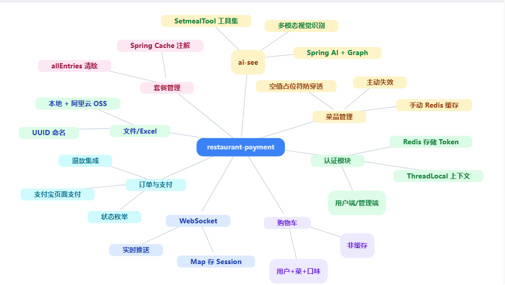

# Restaurant-payment 餐饮和支付系统

restaurant-payment：B2C经营模式，一个餐馆卖家，多个买家。餐馆服务由店长，店员和客户组成。

一个由Spring Boot 3 + Vue 3 的前后端分离架构，中间件使用redis，主业务为餐饮订单和支付的全栈系统，同时Spring AI（这里使用spring-ai-starter-model-openai） 作为单独服务接入，通过菜品识别对应菜单。

------

# 后端说明



**订单状态流转**：

```
1 待支付 → 2 待商家接单 → 3 制作中 → 4 待骑手取餐 → 5 配送中 → 6 已送达 → 7 已完成
        	↓                                      
   8 已取消（未接单退款、商家拒单、超时取消、售后全额退款）
```

**支付流程**：

| 步骤 | 截图 |
| :--: | :--: |
| 集成到订单 |  |
| 支付过程 |  |
| 同步支付成功 |  |
| 异步检验 |  |

# 项目结构

```
restaurant-payment/
├── backend-spring-restaurant/            # 后端代码（Spring Boot 3 多模块）
│   ├── common/                           # 公共模块（常量/异常/工具/JwtProperties/AliOssProperties）
│   │
│   ├── model/                            # 实体与数据传输对象
│   │   ├── dto/                          # LoginDTO/UserDTO/EmployeeDTO/PageDTO
│   │   ├── entity/                       # 实体类（与SQL表名一一对应）
│   │   │   ├── Employee/User             # 账号实体
│   │   │   ├── Dish/DishDetail           # 菜品与菜品口味
│   │   │   ├── Plan/PlanDetail           # 套餐与套餐菜品（原 Setmeal 重命名）
│   │   │   ├── Order/OrderDetail         # 订单与订单明细
│   │   │   ├── OrderPay                  # 订单支付（支付信息独立成表）
│   │   │   ├── OrderShopping             # 购物车（原 ShoppingCart 重命名）
│   │   │   ├── RestaurantCategory        # 餐厅分类
│   │   │   └── UserAddress               # 用户地址
│   │   └── entityenum/                   # 订单/支付/配送状态枚举
│   │
│   ├── mapper/                           # 数据访问层（MyBatis-Plus）
│   │
│   ├── service/                          # 业务逻辑模块
│   │
│   ├── start/                            # 主业务启动模块
│   │   ├── aop/                          # Info/OperationLogging 注解 + ServiceInterceptAspect 切面
│   │   ├── config/                       # SecurityConfig/WebConfig/RedisConfig/JacksonConfig 等
│   │   ├── controller/                   # 按职责分目录
│   │   │   ├── admin/                    # 管理端：AdminEmployeeController/AdminCategoryController
│   │   │   ├── user/                     # 用户端：UserController/CategoryController
│   │   │   ├── login/                    # 登录入口：LoginByEmailController/LoginByOAuthController（预留）
│   │   │   ├── file/                     # 文件上传与Excel：FileController/OSSFileController/ExcelReportController
│   │   │   ├── websocket/                # WebSocket 推送
│   │   │   ├── timetask/                 # 定时任务（订单超时取消等）
│   │   │   └── 支付宝/                   # 支付宝支付/退款/回调/OAuthLogin
│   │   ├── filter/                       # 安全过滤器链
│   │   │   ├── UserRefreshRequestFilter          # user Token 校验/滑动刷新
│   │   │   ├── EmployeeRefreshRequestFilter      # emp  Token 校验/滑动刷新
│   │   │   └── InformationRequestFilter          # 兜底认证拦截
│   │   ├── security/                     # Spring Security 主体与上下文工具
│   │   ├── exceptionHandle/             # GlobalExceptionHandler 全局异常
│   │   ├── metaHandler/                 # AutoMetaObjectHandler 自动填充 createTime/updateTime
│   │   ├── oparation/                   # OperationType 操作类型枚举
│   │   └── img/                         # 初始化图片资源
│   │
│   └── ai-see/                           # AI视觉识别服务（独立服务）
│
├── frontend-vue-admin-restaurant/        # 前端管理端（Vue 3）
│   ├── src/
│   │   ├── api/                          # API接口封装
│   │   ├── views/                        # 页面视图
│   │   ├── layout/                       # 布局组件
│   │   ├── router/                       # 路由配置
│   │   ├── stores/                       # 状态管理（Pinia）
│   │   └── utils/                        # 工具函数
│   └── package.json
│
├── database-sql/                         # 数据库脚本目录
│   ├── sql.txt                           # 数据库create table
│	├── sql插入数据.txt                    # 数据库初始化SQL
│   └── 数据库设计文档.md                   # 数据库设计说明
│
└── 说明/                                 # 项目说明文档
    ├── 原型功能/                         # 前端原型截图
    ├── 第三方授权登录/                    # 支付宝，qq,微信
    ├── 支付功能结果/                      # 支付流程截图
    ├── employee的api文档.md              # 管理端
    └── user的api文档.md                  # 用户端
```

# 环境要求

- JDK 17+
- Spring Boot 3+
- Spring AI 1.1+
- Node.js 20.19.+
- MySQL 8.0+
- Redis 7.0+
- Maven 3.8+
- 以上为最低配置

---

## 一、用户与员工双端登录认证模块

### 需求阶段

需求背景：项目需要同时支撑「管理端员工」和「用户端客户」两套登录体系，且两端的权限、Token、Redis Key 必须互不干扰。

- 传统 Session 认证在前后端分离 + 分布式部署下不好扩展

- 员工端（店长/店员）与用户端（客户）需隔离，避免权限串扰

- 密码明文存储不安全，Token 固定过期会让活跃用户被强制下线

- 第三方登录，目前主流支付宝、qq、微信等，可扩展其他平台

### 策略流程图

常规

```java
员工注册 → AdminEmployeeController/register() → BCrypt加密密码 → MySQL保存 → 返回注册成功
用户注册 → UserController/register()          → BCrypt加密密码 → MySQL保存 → 返回注册成功

员工登录 → AdminEmployeeController/login()
        → 构造 principal="emp:{username}" → AuthenticationManager.authenticate()
        → MultiLoginAuthenticationProvider 按 prefix 区分 emp/user → 查员工表 + BCrypt.matches
        → 生成 JWT(claims: EMP_ID/EMP_NAME/TYPE="emp") → Redis存储("restaurant:emp:{id}")
        → 返回 Token
用户登录 → UserController/login()
        → 构造 principal="user:{username}" → AuthenticationManager.authenticate()
        → MultiLoginAuthenticationProvider 按 prefix 区分 → 查用户表 + BCrypt.matches
        → 生成 JWT(claims: USER_ID/USER_NAME/TYPE="user") → Redis存储("restaurant:user:{id}")
        → 返回 Token

请求拦截 → EmployeeRefreshRequestFilter（仅处理 TYPE=emp，否则放行给 UserFilter）
        → UserRefreshRequestFilter（仅处理 TYPE=user，否则放行）
        → InformationRequestFilter（兜底：未认证返回 401）
        → Redis 校验 Token 一致性 → 滑动过期刷新 → 设置 SecurityContext（ROLE_ADMIN/ROLE_USER）
```
第三方授权登录流程图

| 支付宝 |  |
| ------ | ------------------------------------------------------------ |
|        |  |
|        |  |

### 编码阶段

```java
// MultiLoginAuthenticationProvider.java - 双端登录认证核心
// 通过 principal 前缀 "emp:" / "user:" 区分员工与用户，复用同一套 AuthenticationManager
@Override
public Authentication authenticate(Authentication authentication) throws AuthenticationException {
    String principal = authentication.getName();
    String password = (String) authentication.getCredentials();

    int idx = principal.indexOf(':');
    String type = idx > 0 ? principal.substring(0, idx) : "user";  // 默认按 user 处理
    String username = idx > 0 ? principal.substring(idx + 1) : principal;

    // ===== emp 员工登录 =====
    if ("emp".equals(type)) {
        Employee employee = employeeService.findEmployeename(username);
        if (employee == null || !passwordEncoder.matches(password, employee.getPassword())) {
            throw new BadCredentialsException("用户名或密码错误");
        }
        return new UsernamePasswordAuthenticationToken(
                new LoginPrincipal(employee.getId(), employee.getUsername()),
                null,
                Collections.singletonList(new SimpleGrantedAuthority("ROLE_ADMIN")));
    }
    // ===== user 普通用户登录 =====
    User user = userService.findUsername(username);
    if (user == null || !passwordEncoder.matches(password, user.getPassword())) {
        throw new BadCredentialsException("用户名或密码错误");
    }
    return new UsernamePasswordAuthenticationToken(
            new LoginPrincipal(user.getId(), user.getUsername()),
            null,
            Collections.singletonList(new SimpleGrantedAuthority("ROLE_USER")));
}
```

```java
// UserRefreshRequestFilter.java - user Token 校验与滑动过期（emp Token 直接放行）
// 关键：通过 claims 中的 TYPE 字段区分 token 归属，互不干扰
Map<String, Object> claims = JwtUtil.parseJWT(jwtProperties.getUserSecretKey(), token);
String type = claims.get(JwtConstant.TYPE) != null
        ? claims.get(JwtConstant.TYPE).toString() : "user";
if (!"user".equals(type)) {
    // 不是 user 的 token（emp），交给 EmployeeRefreshRequestFilter 处理
    filterChain.doFilter(request, response);
    return;
}
Long userId = Long.parseLong(claims.get(JwtConstant.USER_ID).toString());
// Redis 校验：防止 Token 被盗用后多端登录
String standardToken = stringRedisTemplate.opsForValue()
        .get(RedisPrefixConstant.USER_AUTHHEADER_PREFIX + userId);
if (!token.equals(standardToken)) {
    response.setStatus(HttpServletResponse.SC_UNAUTHORIZED);
    return;
}
// 设置 SecurityContext（ROLE_USER）
SecurityContextHolder.getContext().setAuthentication(authentication);
// 滑动过期：每次请求刷新 Redis 中 Token 有效期
stringRedisTemplate.expire(RedisPrefixConstant.USER_AUTHHEADER_PREFIX + userId,
        jwtProperties.getUserTtl(), TimeUnit.SECONDS);
```

### 问题修复阶段

Q：为什么要在 JWT claims 里加 TYPE 字段？

> A：项目用同一套 Security 过滤器链处理 `/admin/**` 和 `/user/**` 两类请求。两个过滤器（EmployeeRefreshRequestFilter / UserRefreshRequestFilter）都会拿到同一个 Token，必须靠 claims 里的 `TYPE=emp` / `TYPE=user` 区分归属，否则会出现「员工 Token 被用户过滤器误判」的 401 问题。Login 接口里注释明确写道：`type 必须与过滤器校验一致，否则过滤器不识别该 token 导致 401`。

Q：账户的安全性，为啥放弃传统 MD5 加密？

> A：面对 GPU 海量算力，MD5 几乎失效。BCrypt 提供可调节的工作因子（Cost），人为拉长单次哈希耗时，大幅抬升攻击者算力成本。同时 BCrypt 自动为每个用户生成独立随机盐，盐直接内嵌在密文字符串中，不需要额外设计数据库盐字段，由 Spring Security 原生封装，规避人为编码失误。

Q：Token 过期时间固定，用户活跃时 Token 也会过期

> A：实现滑动过期策略。在 `UserRefreshRequestFilter` / `EmployeeRefreshRequestFilter` 中每次请求都调用 `stringRedisTemplate.expire(...)` 刷新 Redis 中 Token 的有效期，活跃用户感知不到过期。

---

## 二、分类管理模块

### 需求阶段

需求背景：菜品和套餐都需要分类管理，分类数据相对稳定但访问频繁，是典型的「读多写少」场景。

- 分类数量较少但查询频率高，每次查库浪费
- 菜品分类（type=1）与套餐分类（type=2）共用一张 `restaurant_category` 表，需按 type 区分缓存
- 分类修改后需要及时同步到缓存，避免脏数据

### 策略流程图

```java
查询分类（按type） → CategoryController/readByType()
    ├─ @Cacheable(key="#type") 命中缓存 → 直接返回 Redis 数据
    └─ 未命中 → 查询 MySQL → 结果写入 Redis（cacheName::type） → 返回
新增分类 → AdminCategoryController/create() → 写 MySQL → 返回
更新分类 → AdminCategoryController/update() → @CacheEvict(allEntries=true) 写 MySQL → 清空整个缓存
删除分类 → AdminCategoryController/delete() → @CacheEvict(allEntries=true) 删 MySQL → 清空整个缓存
```

### 编码阶段

```java
// AdminCategoryController.java - Spring Cache 声明式缓存
// @CacheConfig 在类级别统一声明 cacheNames，方法级只用 key
@RestController
@RequestMapping("/admin/category")
@CacheConfig(cacheNames = "restaurantCategory:type")
public class AdminCategoryController {

    // 按 type 查询：结果缓存，key 用 SpEL 引用方法参数 #type
    @Cacheable(key = "#type", unless = "#result == null")
    @GetMapping
    public Result readByType(@RequestParam("type") Long type) {
        List<RestaurantCategory> list = restaurantCategoryService.lambdaQuery()
                .eq(RestaurantCategory::getType, type).list();
        return Result.success(list);
    }

    // 更新：写库后清空该 cacheName 下所有缓存，保证一致性
    @CacheEvict(allEntries = true)
    @PutMapping
    public Result update(@RequestBody RestaurantCategoryDTO dto) {
        RestaurantCategory entity = BeanUtil.toBean(dto, RestaurantCategory.class);
        restaurantCategoryService.updateById(entity);
        return Result.success(OperationEnum.UPDATE + "--" + entity.getId());
    }

    // 删除：同样清空所有缓存（因为可能影响按 type 查询的列表）
    @CacheEvict(allEntries = true)
    @DeleteMapping
    public Result delete(@RequestParam List<Long> ids) {
        restaurantCategoryService.removeByIds(ids);
        return Result.success(OperationEnum.DELETE + "--" + ids);
    }
}
```

```java
// RedisConfig.java - 缓存管理器配置
// 统一 TTL 30 分钟，Key 用 String 序列化，Value 用 Jackson JSON 序列化
@Bean
public RedisCacheManager cacheManager(RedisConnectionFactory connectionFactory, ObjectMapper objectMapper) {
    RedisCacheConfiguration defaultConfig = RedisCacheConfiguration.defaultCacheConfig()
            .serializeKeysWith(RedisSerializationContext.SerializationPair
                    .fromSerializer(new StringRedisSerializer()))
            .serializeValuesWith(RedisSerializationContext.SerializationPair
                    .fromSerializer(new GenericJackson2JsonRedisSerializer(redisMapper)))
            .entryTtl(Duration.ofMinutes(30));  // 默认缓存 30 分钟
    return RedisCacheManager.builder(connectionFactory).cacheDefaults(defaultConfig).build();
}
```

### 问题修复阶段

Q：为什么更新/删除用 `@CacheEvict(allEntries=true)` 而不是按 key 删除？

> A：分类查询接口是「按 type 查列表」，缓存的是整个 List。当更新或删除任意一条分类时，受影响的是整个 type 列表，精确按 key 删除很难覆盖所有受影响的缓存条目。`allEntries=true` 直接清空 `restaurantCategory:type` 命名空间下所有缓存，实现简单且不会脏数据。

Q：用户端和管理端都能查分类，缓存会冲突吗？

> A：不会。`CategoryController`（用户端）和 `AdminCategoryController`（管理端）都标注了 `@CacheConfig(cacheNames = "restaurantCategory:type")`，共用同一缓存命名空间。用户端只读，管理端写后清缓存，符合「读共享、写清除」的缓存一致性策略。

---

## 三、菜品管理模块

### 需求阶段

需求背景：菜品是餐馆核心商品，需要支持菜品 CRUD、菜品口味（多口味）、按分类查询、起售/停售等。

- 菜品数据量大，分页查询性能要求高
- 一个菜品对应多个口味（DishDetail），需主子表关联
- 菜品与分类关联，按分类检索是高频查询

### 策略流程图

```java
菜品 CRUD → AdminDishController（管理端） / DishController（用户端）
        → DishService（继承 MyBatis-Plus ServiceImpl，提供基础 CRUD）
        → DishMapper（继承 BaseMapper，单表操作）
        → DishDetailService（菜品口味子表，独立 Service）
新增菜品 → 保存 Dish 主表 → 批量保存 DishDetail 口味列表
查询菜品 → 分页查询（Page + LambdaQueryWrapper）→ 关联查询口味列表
```

### 编码阶段

```java
// DishServiceImpl.java - 基础 Service 架构
// 继承 MyBatis-Plus 的 ServiceImpl，自动获得 save/saveBatch/getById/page 等能力
@Service
public class DishServiceImpl extends ServiceImpl<DishMapper, Dish> implements DishService {
    // 基础 CRUD 由 MyBatis-Plus 提供，业务逻辑可在此扩展
}
```

```java
// 实体关系：Dish（菜品主表） 1:N DishDetail（菜品口味子表）
// Dish.java 对应 dish 表，DishDetail.java 对应 dish_detail 表
// 通过 dish_id 外键关联，一个菜品可有多个口味（如：微辣、中辣、重辣）
```

### 问题修复阶段

Q：菜品口味为什么不和菜品放一张表？

> A：一个菜品对应多个口味是典型的一对多关系。若放一张表会产生大量冗余字段或 JSON 字段，不利于按口味筛选。拆分为 `dish` + `dish_detail` 主子表，通过 `dish_id` 关联，既符合范式，又便于 MyBatis-Plus 单表操作。

---

## 四、套餐管理模块

### 需求阶段

需求背景：套餐是把多个菜品打包销售的形式，支持套餐起售/停售、按分类查询、价格区间检索。

- 套餐与菜品是多对多关系，一个套餐包含多个菜品
- 套餐有独立的分类（type=2），与菜品分类共用 `restaurant_category` 表
- AI 识别模块需要通过套餐描述匹配套餐（见 AI 模块）

### 策略流程图

```java
套餐 CRUD → PlanService（继承 ServiceImpl<PlanMapper, Plan>）
        → PlanDetailService（套餐菜品关联子表）
新增套餐 → 保存 Plan 主表 → 批量保存 PlanDetail（套餐-菜品关联）
AI 套餐推荐 → SetmealTool.@Tool 方法 → LambdaQueryWrapper 多条件组合查询 → 返回套餐列表
```

### 编码阶段

```java
// PlanServiceImpl.java - 套餐基础 Service
@Service
public class PlanServiceImpl extends ServiceImpl<PlanMapper, Plan> implements PlanService {
    // 套餐主表 CRUD，PlanDetail 子表由 PlanDetailService 独立管理
}
```

```java
// AI 模块中的套餐查询工具（见第十节 AI 模块）
// SetmealTool 提供按 ID/名称/分类/价格区间/状态/描述等多维度查询
@Tool(description = "套餐多条件组合查询，支持ID/分类ID/名称/价格/状态/描述/时间的任意组合")
public List<Setmeal> queryByMultiCondition(@ToolParam SetmealToolParam param) {
    LambdaQueryWrapper<Setmeal> wrapper = new LambdaQueryWrapper<>();
    if (param.getId() != null) wrapper.eq(Setmeal::getId, param.getId());
    if (param.getCategoryId() != null) wrapper.eq(Setmeal::getCategoryId, param.getCategoryId());
    // ...其他条件
    return setmealMapper.selectList(wrapper);
}
```

### 问题修复阶段

Q：套餐和菜品为什么共用一张分类表？

> A：分类表 `restaurant_category` 用 `type` 字段区分：`type=1` 菜品分类，`type=2` 套餐分类。共用一张表减少表数量，分类管理接口统一，缓存策略统一（见第二节）。查询时按 `type` 过滤即可隔离两类数据。

---

## 五、订单与购物车模块

### 需求阶段

需求背景：订单是餐饮系统的核心，需支持购物车、下单、状态流转、超时取消等完整流程。

- 订单状态多（8 种状态，见订单状态流转图），状态机复杂
- 购物车是临时数据，需支持增删改查、按用户隔离
- 超时未支付的订单需自动取消，释放库存

### 策略流程图

```
购物车 → OrderShoppingService（继承 ServiceImpl<OrderShoppingMapper, OrderShopping>）
       → 按用户 ID 隔离，加减菜品数量

下单   → OrderServiceImpl（继承 ServiceImpl<OrderMapper, Order>）
       → 校验购物车 → 生成订单（Order 主表 + OrderDetail 明细） → 清空购物车 → 待支付

状态流转 → 1 待支付 → 2 待商家接单（支付成功回调）→ 3 制作中 → 4 待骑手取餐
        → 5 配送中 → 6 已送达 → 7 已完成
        → 8 已取消（超时/拒单/退款）

超时取消 → OrderTask @Scheduled 定时扫描 → 状态=待支付且超时 → 更新为已取消
```

### 编码阶段

```java
// OrderStatusEnum.java - 订单状态枚举（MyBatis-Plus @EnumValue 自动映射）
public enum OrderStatusEnum {
    PENDING_PAYMENT(1L, "待支付：下单未付款"),
    PENDING_MERCHANT_ACCEPT(2L, "待商家接单：已付款，商家还没接单"),
    MERCHANT_COOKING(3L, "商家接单,制作中：商家确认接单，正在做菜"),
    PENDING_RIDER_PICK(4L, "待骑手取餐：商家出餐完成，骑手还没到店"),
    RIDER_DELIVERING(5L, "骑手已取餐，配送中：骑手拿到餐，在路上，实时看定位"),
    RIDER_ARRIVED(6L, "骑手已送达：骑手点送达，等待用户确认"),
    COMPLETED(7L, "订单已完成：系统自动确认收货"),
    CANCELLED(8L, "订单已取消：未接单退款、商家拒单、超时取消、售后全额退款");

    @EnumValue  // MyBatis-Plus 通过此注解将枚举值映射到数据库字段
    private final Long code;
    private final String text;
}
```

```java
// OrderServiceImpl.java - 订单基础 Service
@Service
public class OrderServiceImpl extends ServiceImpl<OrderMapper, Order> implements OrderService {
    // 订单主表 CRUD，OrderDetail 明细由 OrderDetailService 管理
}
```

### 问题修复阶段

Q：订单状态为什么要用枚举而不用魔法数字？

> A：8 种状态如果直接用 `1`/`2`/`3` 等数字，代码可读性差且容易写错。用 `OrderStatusEnum` 枚举 + `@EnumValue` 注解，既保证类型安全，又让 MyBatis-Plus 自动完成「枚举 ↔ 数据库 code」的双向映射，无需手写转换逻辑。

---

## 六、支付宝支付模块

### 需求阶段

需求背景：订单支付是餐饮系统的资金入口，需对接第三方支付。项目选择支付宝电脑网站支付（沙箱环境），支持下单、查询、退款、关单、OAuth 授权登录。

- 支付流程涉及同步跳转（用户可见）和异步通知（服务端验签），两者职责不同
- 异步通知必须验签，防止伪造请求篡改订单状态
- 退款是逆向流程，需独立的退款查询接口确认到账

### 策略流程图

```
电脑网站支付 → GET /pay/order?outTradeNo=&amount=&subject=
            → AlipayService.createPagePayForm() → 构造 AlipayTradePagePayRequest
            → 设置 notifyUrl（异步）+ returnUrl（同步）+ timeout_express=60m
            → 返回支付宝收银台 HTML 表单 → 浏览器自动跳转到沙箱收银台

同步返回   → GET /pay/return → 用户看到「已返回商户页面」提示
异步通知   → POST /pay/notify（必须公网可访问）
           → AlipaySignature.rsaCheckV1 验签 → 校验 app_id → 校验金额
           → 幂等检查（订单是否已处理）→ 更新订单状态为已支付 → 返回 "success"

退款      → POST /pay/refund → AlipayService.refund() → AlipayTradeRefundRequest
退款查询  → GET /pay/refund/query → 确认退款到账
关单      → POST /pay/order/close → 超时未支付关闭交易

OAuth授权 → GET /oauth/authorize → 302 跳转支付宝授权页
         → GET /oauth/callback?auth_code= → auth_code 换 access_token → 拉取用户资料
```

### 编码阶段

```java
// AlipayService.java - 电脑网站支付（沙箱可用）
public String createPagePayForm(PayDTO payDTO) throws AlipayApiException {
    Map<String, Object> bizContent = new LinkedHashMap<>();
    bizContent.put("out_trade_no", payDTO.getOutTradeNo());       // 商户订单号
    bizContent.put("total_amount", payDTO.getTotalAmount().toPlainString()); // 金额（元）
    bizContent.put("subject", payDTO.getSubject());                // 订单名称
    bizContent.put("product_code", "FAST_INSTANT_TRADE_PAY");      // 固定产品码
    bizContent.put("timeout_express", "60m");                      // 60分钟超时

    AlipayTradePagePayRequest request = new AlipayTradePagePayRequest();
    request.setNotifyUrl(alipayProperties.getNotifyUrl());  // 异步通知地址（必须公网）
    request.setReturnUrl(alipayProperties.getReturnUrl());  // 同步跳转地址
    request.setBizContent(toJson(bizContent));
    AlipayTradePagePayResponse response = getClient().pageExecute(request);
    return response.getBody();  // 返回一段 HTML，浏览器自动提交跳转到收银台
}
```

```java
// OAuthLogin.java - 支付宝授权登录（auth_code 换 access_token）
@GetMapping("/callback")
public Map<String, Object> callback(@RequestParam("auth_code") String authCode) throws AlipayApiException {
    // 1. auth_code 换取 access_token
    AlipaySystemOauthTokenRequest tokenReq = new AlipaySystemOauthTokenRequest();
    tokenReq.setCode(authCode);
    tokenReq.setGrantType("authorization_code");
    AlipaySystemOauthTokenResponse tokenResp = client.execute(tokenReq);

    String accessToken = tokenResp.getAccessToken();
    String openId = tokenResp.getOpenId();

    // 2. access_token 获取用户资料（昵称、头像、性别、邮箱）
    AlipayUserInfoShareRequest userReq = new AlipayUserInfoShareRequest();
    userReq.putOtherTextParam("auth_token", accessToken);
    AlipayUserInfoShareResponse userResp = client.execute(userResp);

    Map<String, Object> result = new HashMap<>();
    result.put("openId", openId);
    result.put("accessToken", accessToken);
    result.put("nickName", userResp.getNickName());
    result.put("avatar", userResp.getAvatar());
    return result;
}
```

### 问题修复阶段

Q：同步返回和异步通知有什么区别？为什么都要？

> A：同步返回（returnUrl）是用户支付后浏览器跳回商户页，仅用于展示「支付成功」提示，**不可信**（用户可手动改 URL）。异步通知（notifyUrl）是支付宝服务器主动 POST 到商户后台，**可信**，必须验签。订单状态只能以异步通知为准，同步返回只做 UI 提示。

Q：异步通知本地怎么测？

> A：支付宝只能向公网地址发 POST。本地 `localhost` 支付宝访问不到，需用内网穿透（ngrok、cpolar 等）把本机映射成公网 HTTPS，把 `notify-url` 配成公网地址 + `/pay/notify`。`application-dev.yml` 中默认是 `https://localhost:8080/pay/notify`，仅用于联调，生产必须改公网域名。

Q：异步通知为什么要返回 "success" / "failure"？

> A：支付宝若收不到 `success` 会按策略重试（8 次）。验签失败、金额不一致、订单不存在等异常情况必须返回 `failure`，让支付宝重试，避免丢失通知。订单已处理过的幂等场景返回 `success`，避免重复处理。注释中明确：「捕获异常返回 failure，让支付宝重试，避免丢失通知」。

Q：退款为什么要单独查一次？

> A：退款是异步处理，`AlipayTradeRefundRequest` 返回成功只代表支付宝受理了退款，不代表钱已到账。需调用 `AlipayTradeFastpayRefundQueryRequest` 查询退款状态，确认资金已退回买家账户，避免「受理成功但退款失败」的客诉。

---

## 七、文件上传与 Excel 导出模块

### 需求阶段

需求背景：菜品图片、员工头像、用户头像需要上传；运营需要导出用户数据为 Excel 报表。

- 本地存储在多实例部署时文件不一致
- 大文件上传需限制大小（10MB）
- Excel 导出需支持流式下载，避免内存溢出

### 策略流程图

```
文件上传（本地） → POST /local → UUID生成文件名 → 保存到 ku/image 目录 → 返回本地路径
文件上传（OSS）  → POST /oss  → UUID生成文件名 → AliOssUtil上传到阿里云 → 返回 CDN URL
文件下载（本地） → GET /local?fileName= → 读取本地文件 → Content-Disposition → 返回流
文件下载（OSS）  → GET /oss?url= → 从 OSS URL 拉取字节流 → 返回 ResponseEntity<byte[]>
Excel 导出       → POST /report/excel/write → EasyExcel.write → 写入 report.xlsx
Excel 读取       → POST /report/excel/read  → EasyExcel.read → AnalysisEventListener 解析
Excel 下载       → GET /report/excel/download → 流式下载
```

### 编码阶段

```java
// FileController.java - 本地文件上传（UUID 防冲突 + URLEncoder 防中文乱码）
private static final String PATH = "ku/image";

@PostMapping
public Result upload(MultipartFile file) {
    String originalFilename = file.getOriginalFilename();
    File path = new File(PATH);
    if (!path.exists()) path.mkdirs();
    // UUID + 原扩展名，避免文件名冲突和文件遍历攻击
    String saveName = UUID.randomUUID().toString() +
            originalFilename.substring(originalFilename.lastIndexOf("."));
    file.transferTo(new File(path, saveName));
    return Result.success(path + "::" + saveName);
}

@GetMapping
public void download(String fileName, HttpServletResponse response) {
    File path = new File(PATH, fileName);
    response.setContentType("application/octet-stream");
    // 中文文件名用 URLEncoder 编码，避免下载乱码
    String encoded = URLEncoder.encode(fileName, StandardCharsets.UTF_8);
    response.setHeader("Content-Disposition", "attachment;filename=" + encoded);
    try (InputStream in = new FileInputStream(path)) {
        StreamUtils.copy(in, response.getOutputStream());
    }
}
```

```java
// AliOssUtil.java - 阿里云 OSS 上传
public String uploadFile(String objectName, InputStream inputStream) {
    OSS ossClient = new OSSClientBuilder().build(endpoint, accessKeyId, accessKeySecret);
    try {
        ossClient.putObject(bucketName, objectName, inputStream);
    } finally {
        ossClient.shutdown();  // 必须关闭，否则连接泄漏
    }
    // 返回 CDN 访问 URL：https://{bucket}.{endpoint}/{objectName}
    return "https://" + bucketName + "." + endpoint + "/" + objectName;
}
```

### 问题修复阶段

Q：为什么提供两种文件存储方式？

> A：本地存储用于开发测试，简单快捷；阿里云 OSS 用于生产，支持高可用和 CDN 加速。`FileController` 走本地 `ku/image`，`OSSFileController` 走云端，业务按需选择。

Q：文件命名为什么用 UUID？

> A：UUID 全局唯一，避免文件名冲突，同时增加安全性（防止文件遍历攻击——攻击者无法通过猜文件名下载他人文件）。

Q：文件下载中文文件名乱码

> A：用 `URLEncoder.encode(fileName, StandardCharsets.UTF_8)` 编码文件名，再设置 `Content-Disposition: attachment;filename=` 响应头。OSS 下载则用 `new String(decodedFilename.getBytes("UTF-8"), "ISO-8859-1")` 双重编码兼容旧浏览器。

---

## 八、WebSocket 实时通信模块

### 需求阶段

需求背景：商家端需要实时收到新订单提醒（来单提醒），用户端需要实时看到订单状态变化。传统 HTTP 轮询延迟高、服务器压力大。

- 订单状态变化需实时推送到管理端（来单提醒）
- 多个客户端（店长、店员）需同时接收消息
- 长连接需管理 Session 生命周期

### 策略流程图

```
客户端连接 → ws://host:port/websocket/{id} → @OnOpen → sessionMap.put(id, session)
客户端发消息 → @OnMessage → 打印日志（业务可扩展）
服务端推送 → sendToAllClient(message) → 遍历 sessionMap → session.getBasicRemote().sendText()
连接断开   → @OnClose → sessionMap.remove(id)
```

### 编码阶段

```java
// WebSocketServer.java - 原生 Jakarta WebSocket 实现
@Component
@ServerEndpoint("/websocket/{id}")  // 路径参数 id 标识客户端
public class WebSocketServer {

    // 静态 Map 存放所有会话（@ServerEndpoint 每次连接会 new 实例，必须用 static）
    private static Map<String, Session> sessionMap = new HashMap<>();

    @OnOpen
    public void onOpen(Session session, @PathParam("id") String id) {
        sessionMap.put(id, session);  // 建立连接时加入会话池
    }

    @OnClose
    public void onClose(@PathParam("id") String id) {
        sessionMap.remove(id);  // 断开时移除，避免内存泄漏
    }

    // 群发消息：来单提醒时调用，所有管理端客户端都能收到
    public void sendToAllClient(String message) {
        for (Session session : sessionMap.values()) {
            try {
                session.getBasicRemote().sendText(message);
            } catch (Exception e) {
                e.printStackTrace();
            }
        }
    }
}
```

```java
// WebSocketConfig.java - 注册 ServerEndpointExporter
@Configuration
public class WebSocketConfig {
    @Bean
    public ServerEndpointExporter serverEndpointExporter() {
        return new ServerEndpointExporter();  // 启用原生 @ServerEndpoint 支持
    }
}
```

### 问题修复阶段

Q：为什么 sessionMap 必须是 `static`？

> A：`@ServerEndpoint` 注解的类，容器每次新连接都会创建一个新实例（非单例）。如果 `sessionMap` 是实例变量，每个实例有自己的 Map，无法共享会话。用 `static` 让所有实例共享同一个会话池，群发消息才能触达所有客户端。

Q：为什么用原生 WebSocket 而不是 STOMP？

> A：项目场景简单（来单提醒 + 状态推送），原生 `@ServerEndpoint` 足够，无需 STOMP 的订阅/主题模型。原生方案轻量，依赖少，`ServerEndpointExporter` 一个 Bean 即可启用。

---

## 九、AOP 操作日志模块

### 需求阶段

需求背景：管理端的增删改查操作需记录审计日志，便于追溯谁在什么时间做了什么操作。同时业务方法需记录执行耗时用于性能监控。

- 操作日志需自动记录，不能侵入业务代码
- 需区分操作类型（CREATE/READ/UPDATE/DELETE）
- 需记录操作人、操作结果（成功/失败）、入参

### 策略流程图

```
业务方法标注 @OperationLogging(operation=CREATE)
    → ServiceInterceptAspect 拦截 → 执行目标方法
    ├─ 成功 → OperationType.ok(operation, args) → log.info
    └─ 异常 → OperationType.error(operation, args) → log.info → 异常继续抛出

业务方法标注 @Info(desc="描述")
    → ServiceInterceptAspect 拦截 → 记录目标类/方法/入参/耗时/返回值/异常
```

### 编码阶段

```java
// OperationLogging.java - 操作日志注解
@Target({ElementType.METHOD})
@Retention(RetentionPolicy.RUNTIME)
public @interface OperationLogging {
    // 操作类型：CREATE / READ / UPDATE / DELETE
    OperationEnum operation() default OperationEnum.CREATE;
}

// Info.java - 方法信息注解
@Target({ElementType.METHOD})
@Retention(RetentionPolicy.RUNTIME)
public @interface Info {
    String desc() default "未描述";        // 方法描述
    boolean recordCostTime() default true; // 是否记录耗时
}
```

```java
// ServiceInterceptAspect.java - 双切面：@Info 耗时监控 + @OperationLogging 操作日志
@Aspect
@Component
public class ServiceInterceptAspect {

    // @OperationLogging 切面：自动记录操作日志
    @Around("@annotation(start.aop.OperationLogging)")
    public Object interceptOperationLog(ProceedingJoinPoint joinPoint) throws Throwable {
        MethodSignature signature = (MethodSignature) joinPoint.getSignature();
        OperationLogging annotation = signature.getMethod().getAnnotation(OperationLogging.class);
        String operation = annotation.operation().name();  // CREATE/READ/UPDATE/DELETE
        String methodArgs = Arrays.toString(joinPoint.getArgs());
        try {
            Object result = joinPoint.proceed();  // 执行业务方法
            OperationType.ok(operation, methodArgs);  // 成功日志
            return result;
        } catch (Exception e) {
            OperationType.error(operation, methodArgs);  // 失败日志
            throw e;  // 异常继续抛，保证全局异常处理器能处理
        }
    }
}
```

```java
// OperationType.java - 操作日志实体（用 log.info 输出，确保默认可见）
public static OperationType ok(String operation, Object message) {
    OperationType op = new OperationType();
    op.operation = operation;
    op.id = SecurityContextParam.getCurrentUserId();  // 从 SecurityContext 取操作人
    op.status = "SUCCESS";
    op.message = message;
    log.info("用户ID:" + op.id + ", 执行操作:" + op.operation + ", " + message + ", " + op.status);
    return op;
}
```

### 问题修复阶段

Q：`@OperationLogging` 注解看似没生效，日志没输出？

> A：早期 `OperationType.ok()/error()` 用的是 `log.debug(...)`，Spring Boot 默认日志级别是 INFO，debug 级别日志不输出。修复为 `log.info(...)`，操作日志在默认配置下可见。也可在 `application.yml` 中开启 `logging.level.start.oparation: debug` 替代。

Q：为什么异常要继续抛出？

> A：`@OperationLogging` 切面 `catch` 异常记录错误日志后必须 `throw e`，否则异常被吞掉，`GlobalExceptionHandler` 全局异常处理器收不到异常，前端会收到 200 但实际业务失败。注释明确：「异常继续向上抛，保证全局异常处理器能处理」。

Q：操作人 ID 怎么获取？

> A：通过 `SecurityContextParam.getCurrentUserId()`，底层从 `SecurityContextHolder.getContext().getAuthentication().getPrincipal()` 取出 `LoginPrincipal.getId()`。因为操作日志切面运行在 Controller 方法上，此时 Security 过滤器已设置好 SecurityContext，可直接读取当前登录用户。

---

## 十、AI 视觉识别服务模块（ai-see 独立服务）

### 需求阶段

需求背景：用户上传菜品图片，系统自动识别图片中的食物/饮料，并匹配对应套餐推荐。这是项目的差异化能力，用 Spring AI + 视觉模型 + Function Calling 实现。

- 单次调用需串联「视觉识别」和「套餐查询」两个步骤，是多节点编排
- 套餐查询需支持多条件组合（ID/名称/分类/价格/状态/描述）
- 需要对话记忆，支持多轮交互

### 策略流程图

```
用户上传图片+问题 → POST /ai/see
    → 图片转 Base64 → CompiledGraph.invoke({question, file})
    → node1: VisualFunction（视觉识别节点）
        → Media(image/jpeg, base64) → visualChatClient.prompt("识别有哪些食物,饮料？")
        → 输出 visualResult（如"鱼、啤酒、豆腐"）
    → node2: ToolFunction（工具查询节点）
        → toolClient.prompt(visualResult) → 触发 @Tool 方法
        → SetmealTool.queryByDescription(关键词) → LambdaQueryWrapper 模糊匹配
        → 输出 toolResult（匹配的套餐列表）
    → 返回 "visualResult + toolResult"
```

### 编码阶段

```java
// NodeLink.java - Spring AI Alibaba Graph 流程编排
// 定义 StateGraph，串联 visualFunction → toolFunction 两个节点
@Bean("see")
public CompiledGraph toSee() {
    KeyStrategyFactory strategyFactory = () -> Map.of(
            "visualResult", new ReplaceStrategy(),  // 视觉识别结果（覆盖策略）
            "toolResult", new ReplaceStrategy()     // 工具查询结果（覆盖策略）
    );
    StateGraph graph = new StateGraph("see", strategyFactory);
    // 节点
    graph.addNode("node1", AsyncNodeAction.node_async(visualFunction));  // 视觉识别
    graph.addNode("node2", AsyncNodeAction.node_async(toolFunction));    // 工具查询
    // 边：START → node1 → node2 → END
    graph.addEdge(StateGraph.START, "node1");
    graph.addEdge("node1", "node2");
    graph.addEdge("node2", StateGraph.END);
    return graph.compile();
}
```

```java
// VisualFunction.java - 视觉识别节点（NodeAction 实现）
// 从 state 取 Base64 图片，构造 Media 调用多模态模型识别食物
@Override
public Map<String, Object> apply(OverAllState state) throws Exception {
    String base64 = (String) state.value("file").orElse("文件为空");
    Media media = new Media(MimeTypeUtils.IMAGE_JPEG,
            URI.create("data:image/jpeg;base64," + base64));
    String result = visualClient.prompt()
            .user(promptUserSpec -> promptUserSpec.text("识别有哪些食物,饮料？").media(media))
            .call()
            .content();
    return Map.of("visualResult", result != null ? result : "没有识别到内容");
}
```

```java
// SetmealTool.java - Function Calling 工具（@Tool 注解，AI 自动调用）
@Tool(description = "根据图片识别出的食材、饮品关键词，模糊匹配套餐的菜品描述字段")
public List<Setmeal> queryByDescription(@ToolParam(description = "食物、饮料关键词") SetmealToolParam param) {
    LambdaQueryWrapper<Setmeal> wrapper = new LambdaQueryWrapper<>();
    String key = param.getDescription() == null ? "" : param.getDescription().trim();
    if (!key.isEmpty()) {
        wrapper.like(Setmeal::getDescription, key);  // 模糊匹配描述
    }
    wrapper.like(Setmeal::getName, key);  // 同时匹配名称
    return setmealMapper.selectList(wrapper);
}
```

```java
// SpringAiConfig.java - 对话记忆配置（MessageWindowChatMemory 滑动窗口）
@Bean
public ChatMemory chatMemory(ChatMemoryRepository chatMemoryRepository) {
    return MessageWindowChatMemory.builder()
            .chatMemoryRepository(chatMemoryRepository)
            .maxMessages(20)  // 保留最近 20 条消息，超出自动淘汰
            .build();
}
```

### 问题修复阶段

Q：为什么图片要转 Base64 再传给 Graph？

> A：`CompiledGraph.invoke()` 的 state 是 `Map<String, Object>`，Graph 框架无法直接处理 `byte[]`（序列化和传递有问题）。在 `SeeController` 中先 `Base64.getEncoder().encodeToString(file.getBytes())`，再以字符串形式放入 state，`VisualFunction` 取出后构造 `data:image/jpeg;base64,...` 的 URI 交给 `Media` 解析。注释明确：「将文件转为 Base64 字符串再传入 state，避免 graph 框架无法处理 byte[]」。

Q：为什么用 Graph 编排而不是直接串联两次 ChatClient 调用？

> A：Graph（Spring AI Alibaba Graph）提供状态管理和节点编排能力。`StateGraph` 定义节点和边，`OverAllState` 在节点间传递数据（`visualResult` → `toolResult`）。这种方式易于扩展更多节点（如加「推荐排序」节点），且每个节点可独立测试。直接串联调用则逻辑耦合，难以扩展。`NodeLink` 还会打印 PlantUML 流程图便于可视化。

Q：Function Calling 怎么触发？

> A：`ToolConfiguration` 中构建 `toolClient` 时通过 `.defaultTools(setmealTool)` 注册工具。当 `ToolFunction` 调用 `toolClient.prompt().user(visualResult)` 时，模型根据用户输入自动判断是否调用 `@Tool` 方法。`SetmealTool` 中 7 个 `@Tool` 方法（queryById/queryByName/queryByCategoryId/queryByPriceRange/queryByStatus/queryByDescription/queryByMultiCondition）由模型自主选择调用。

Q：模型用哪个？

> A：`application.properties` 配置 `spring.ai.openai.base-url=https://api.siliconflow.cn`，用硅基流动的 OpenAI 兼容接口，模型 `Qwen/Qwen3.5-397B-A17B`。Spring AI 的 `spring-ai-starter-model-openai` 可对接任何 OpenAI 兼容 API，不限于 OpenAI 官方。

---

## 十一、全局异常处理与自动填充模块

### 需求阶段

需求背景：项目需统一的异常响应格式和审计字段自动填充，避免每个 Controller 重复处理。

- 业务异常、数据库异常、未知异常需统一封装为 `Result` 返回
- 唯一约束冲突（如重复用户名）需给出友好提示
- `create_time`/`update_time`/`create_user`/`update_user` 四个审计字段需自动填充，不能依赖手动 set

### 策略流程图

```
Controller 抛异常
    ├─ BaseException（自定义业务异常）→ GlobalExceptionHandler → Result.error(msg)
    ├─ SQLIntegrityConstraintViolationException（唯一约束冲突）→ 解析 Duplicate entry → 返回"用户名已存在"
    └─ 其他异常 → 默认 500

MyBatis-Plus insert/update
    ├─ insertFill → 自动填充 createTime/updateTime/createUser/updateUser
    └─ updateFill → 自动填充 updateTime/updateUser
```

### 编码阶段

```java
// GlobalExceptionHandler.java - 全局异常处理
@RestControllerAdvice
@Slf4j
public class GlobalExceptionHandler {

    // 自定义业务异常：返回 200 + Result.error（业务错误由前端提示文案决定）
    @ExceptionHandler(BaseException.class)
    public Result exception(BaseException e) {
        return Result.error(e.getMessage() + ">>>>去联系管理员");
    }

    // 数据库唯一约束冲突（如重复用户名）：解析 Duplicate entry 给出友好提示
    @ExceptionHandler(SQLIntegrityConstraintViolationException.class)
    public Result handleSQLIntegrityConstraintViolationException(SQLIntegrityConstraintViolationException e) {
        String message = e.getMessage();
        if (message.contains("Duplicate entry")) {
            String[] split = message.split("'");
            String username = split[1];
            return Result.error(username + ErrorConstant.USERNAME_EXIST);  // "xxx用户名已存在"
        }
        return Result.error(ErrorConstant.ERROR + e.getMessage());
    }
}
```

```java
// AutoMetaObjectHandler.java - MyBatis-Plus 自动填充审计字段
@Component
public class AutoMetaObjectHandler implements MetaObjectHandler {

    private Long getUserId() {
        return SecurityContextParam.getCurrentUserId();  // 从 SecurityContext 取当前用户
    }

    @Override
    public void insertFill(MetaObject metaObject) {
        // 新增时填充四个字段
        this.setFieldValByName(FillHandleConstant.CREATE_TIME_HANDLER, LocalDateTime.now(), metaObject);
        this.setFieldValByName(FillHandleConstant.UPDATE_TIME_HANDLER, LocalDateTime.now(), metaObject);
        this.setFieldValByName(FillHandleConstant.CREATE_USER_HANDLER, getUserId(), metaObject);
        this.setFieldValByName(FillHandleConstant.UPDATE_USER_HANDLER, getUserId(), metaObject);
    }

    @Override
    public void updateFill(MetaObject metaObject) {
        // 更新时只填充 updateTime 和 updateUser
        this.setFieldValByName(FillHandleConstant.UPDATE_TIME_HANDLER, LocalDateTime.now(), metaObject);
        this.setFieldValByName(FillHandleConstant.UPDATE_USER_HANDLER, getUserId(), metaObject);
    }
}
```

### 问题修复阶段

Q：为什么业务异常返回 200 而不是 4xx/5xx？

> A：业务异常（如「用户名已存在」「密码错误」）是用户输入问题，不是服务器错误。返回 200 + `Result.error(msg)` 让前端统一通过 `Result.code` 判断业务成败，HTTP 状态码保持 200 避免触发前端的网络错误处理逻辑。注释明确：「返回 200 状态码 + Result.error（业务错误由前端提示文案决定）」。

Q：自动填充的 `createUser` 在未登录场景下怎么办？

> A：`AutoMetaObjectHandler.getUserId()` 从 `SecurityContextParam.getCurrentUserId()` 取值，未登录时返回 `null`。例如 `AdminEmployeeController.register()` 注册接口是放行接口（未登录），此时 `createUser` 会是 `null`。代码中 `employee.setCreateUser(0L)` 手动设置为 0，表示「系统/预置数据」。

---

# 核心组件设计

### 1. 双端认证过滤器链（SecurityFilterChain）

```java
// SecurityConfig.java - 三层过滤器链设计
http.authorizeHttpRequests(auth -> auth
        .requestMatchers("/user/register", "/user/login").permitAll()      // 用户端登录注册放行
        .requestMatchers("/admin/register", "/admin/login").permitAll()    // 管理端登录注册放行
        .requestMatchers("/admin/**", "/user/**").authenticated()          // 两端业务接口需认证
        .anyRequest().permitAll())                                         // 其他放行
    // 过滤器顺序：user → emp → 兜底
    .addFilterBefore(userRefreshRequestFilter, UsernamePasswordAuthenticationFilter.class)
    .addFilterBefore(employeeRefreshRequestFilter, UsernamePasswordAuthenticationFilter.class)
    .addFilterBefore(informationRequestFilter, UsernamePasswordAuthenticationFilter.class);
```

Q：为什么用三个过滤器而不是一个？

> A：职责分离。`UserRefreshRequestFilter` 只处理 `TYPE=user` 的 Token，`EmployeeRefreshRequestFilter` 只处理 `TYPE=emp` 的 Token，两者通过 claims 中的 TYPE 字段互斥，非自己类型的 Token 直接 `filterChain.doFilter()` 放行给下一个。`InformationRequestFilter` 兜底，检查 SecurityContext 是否有认证信息，没有就返回 401。这样设计每个过滤器职责单一，易于维护和测试。

### 2. Spring Cache 缓存抽象

```java
// 项目统一用 Spring Cache 声明式注解，底层切换 Redis
// @Cacheable：查询时缓存（key 用 SpEL，如 #type）
// @CacheEvict：写操作后清除缓存（allEntries=true 清整个命名空间）
// @CacheConfig：类级别统一 cacheNames，方法级只写 key
```

Q：为什么用 Spring Cache 而不是手动操作 Redis？

> A：分类管理是典型的「读多写少」场景，`@Cacheable`/`@CacheEvict` 声明式缓存足够，代码侵入小。底层 `RedisCacheManager` 统一配置 TTL（30 分钟）和序列化方式，切换缓存实现（如 Caffeine）只需改配置。手动操作 Redis 更灵活但代码侵入大，项目在需要精细控制的场景（如 Token 存储）才直接用 `StringRedisTemplate`。

### 3. 多模态 AI 编排（StateGraph）

```java
// Spring AI Alibaba Graph 的 StateGraph 模型
// 节点（NodeAction）+ 边（Edge）+ 状态（OverAllState）
// 适合多步骤、有状态流转的 AI 工作流
```

Q：为什么不用 LangChain4j 而用 Spring AI Alibaba Graph？

> A：项目技术栈是 Spring Boot 3 + Spring AI，Graph 是 Spring AI Alibaba 生态原生组件，与 Spring AI 的 `ChatClient`/`@Tool` 无缝集成。Graph 的 `StateGraph` + `OverAllState` 模型适合「视觉识别 → 工具查询」这种多节点编排，且能自动生成 PlantUML 流程图便于可视化。

---

# 依赖说明

### 用户与员工认证功能依赖

| 依赖 | 版本 | 功能支撑 |
| :--- | :--- | :--- |
| Spring Boot Starter Security | 3.3.8 | SecurityConfig 注册 BCryptPasswordEncoder；SecurityFilterChain 配置三层过滤器链；MultiLoginAuthenticationProvider 实现双端登录认证 |
| Spring Boot Starter Data Redis | 3.3.8 | 存储 user Token（`restaurant:user:{id}`）和 emp Token（`restaurant:emp:{id}`）；滑动过期策略刷新 TTL |
| JJWT API/Impl/Jackson | 0.12.6 | JwtUtil 生成/解析 JWT；claims 中携带 USER_ID/EMP_ID/TYPE 实现双端区分 |
| Spring Boot Starter Web | 3.3.8 | UserController/AdminEmployeeController 提供 REST 接口（注册/登录/登出） |

### 分类管理功能依赖

| 依赖 | 版本 | 功能支撑 |
| :--- | :--- | :--- |
| Spring Boot Starter Data Redis | 3.3.8 | **缓存策略**：@Cacheable(key="#type") 按 type 区分缓存；@CacheEvict(allEntries=true) 写后清除；RedisCacheManager 统一 TTL 30 分钟 |
| MyBatis Plus | 3.5.9 | RestaurantCategoryMapper 继承 BaseMapper；LambdaQuery 实现按 type/name 分页查询 |
| Hutool All | 5.8.26 | BeanUtil 进行 DTO 转 Entity（RestaurantCategoryDTO → RestaurantCategory） |

### 支付宝支付功能依赖

| 依赖 | 版本 | 功能支撑 |
| :--- | :--- | :--- |
| Alipay SDK Java | 4.40.658.ALL | AlipayService 实现电脑网站支付（AlipayTradePagePayRequest）、交易查询、退款、退款查询、关单；OAuthLogin 实现 auth_code 换 access_token |
| Spring Boot Starter Web | 3.3.8 | 提供 HttpServletResponse 流式输出支付宝收银台 HTML；@ConfigurationProperties 绑定 AlipayProperties |

### AI 视觉识别功能依赖

| 依赖 | 版本 | 功能支撑 |
| :--- | :--- | :--- |
| Spring AI BOM | 1.1.0 | 统一管理 Spring AI 版本 |
| spring-ai-starter-model-openai | 1.1.0 | OpenAiChatModel 提供多模态对话能力；对接硅基流动 Qwen 模型 |
| spring-ai-alibaba-graph-core | 1.1.0.0 | StateGraph 编排视觉识别节点和工具查询节点；OverAllState 在节点间传递状态 |
| Spring AI Advisors Vector Store | 1.1.0 | MessageChatMemoryAdvisor 对话记忆；SimpleLoggerAdvisor 日志审计 |

### 文件上传功能依赖

| 依赖 | 版本 | 功能支撑 |
| :--- | :--- | :--- |
| Aliyun SDK OSS | 3.17.4 | AliOssUtil 实现文件上传到阿里云 OSS，返回 CDN 访问 URL |
| Spring Boot Starter Web | 3.3.8 | MultipartFile 文件上传支持；StreamUtils 流式下载 |
| EasyExcel | 3.3.2 | ExcelReportController 实现 Excel 读写下载（当前代码已注释，待启用） |

### AOP 操作日志功能依赖

| 依赖 | 版本 | 功能支撑 |
| :--- | :--- | :--- |
| Spring Boot Starter AOP | 3.3.8 | ServiceInterceptAspect 切面拦截 @Info/@OperationLogging 注解；@Around 环绕通知记录耗时和操作日志 |
| Spring Boot Starter Security | 3.3.8 | OperationType 通过 SecurityContextParam.getCurrentUserId() 获取操作人 ID |

### WebSocket 实时通信功能依赖

| 依赖 | 版本 | 功能支撑 |
| :--- | :--- | :--- |
| Spring Boot Starter Web | 3.3.8 | WebSocketConfig 注册 ServerEndpointExporter；原生 Jakarta WebSocket 实现 @ServerEndpoint |

### 全局异常与自动填充功能依赖

| 依赖 | 版本 | 功能支撑 |
| :--- | :--- | :--- |
| Spring Boot Starter Web | 3.3.8 | @RestControllerAdvice 全局异常捕获；ExceptionHandler 处理 BaseException 和 SQLIntegrityConstraintViolationException |
| MyBatis Plus | 3.5.9 | AutoMetaObjectHandler 实现 MetaObjectHandler；insertFill/updateFill 自动填充 createTime/updateTime/createUser/updateUser |

---

### 对比分析

**问题1：单过滤器处理双端 Token**

```java
// 其他人写法 - 混乱！
public class SingleFilter extends OncePerRequestFilter {
    protected void doFilterInternal(...) {
        // 一个过滤器里 if-else 判断 user/emp，逻辑耦合，难以维护
        if (type.equals("user")) { ... }
        else if (type.equals("emp")) { ... }
    }
}
```
> 本项目改进：拆为 `UserRefreshRequestFilter` + `EmployeeRefreshRequestFilter` 两个过滤器，各自只处理自己类型的 Token，非自己类型的直接放行。职责单一，互不干扰。

**问题2：操作日志用 debug 级别**

```java
// 其他人写法 - 看不到日志！
public static OperationType ok(String operation, Object message) {
    log.debug("操作:" + operation);  // 默认 INFO 级别，debug 不输出
    return op;
}
```
> 本项目改进：改为 `log.info(...)`，确保默认配置下操作日志可见。也可在 `application.yml` 开启 `logging.level.start.oparation: debug` 替代。

**问题3：异步通知不验签**

```java
// 其他人写法 - 危险！
@PostMapping("/notify")
public String notify(HttpServletRequest request) {
    String outTradeNo = request.getParameter("out_trade_no");
    orderService.updateStatus(outTradeNo, PAID);  // 不验签直接更新，可被伪造
    return "success";
}
```
> 本项目改进：异步通知必须 `AlipaySignature.rsaCheckV1` 验签，校验 `app_id`、金额一致性，做幂等检查（订单是否已处理）。验签失败返回 `failure` 让支付宝重试，避免丢失通知。

---

# 前端说明

## 管理端界面

| 功能页面 | 截图 |
| :--: | :--: |
| 登录页面 |  |
| 菜谱分类 |  |
| 员工管理 |  |
| 工作台 |  |
| 菜品管理 |  |
| 套餐管理 |  |
| 订单作台 |  |
| 店铺管理 |  |


---
