<div align="center">
  <h1>Restaurant-payment 餐饮和支付系统</h1>
    <h2>restaurant-payment：B2C经营模式，一个餐馆卖家，多个买家。餐馆服务由店长，店员和客户组成。</h2>
    <h4>一个由Spring Boot 3 + Vue 3 的前后端分离架构，中间件使用redis，主业务为餐饮订单和支付的全栈系统，同时Spring AI（spring-ai-starter-model-openai） 作为单独服务接入，通过菜品识别对应菜单。
    </h4>
    <h1>配置要求</h1>
    
    
    
    
    
    
  </p>
</div>


------

# 架构图

| 数据流向 | 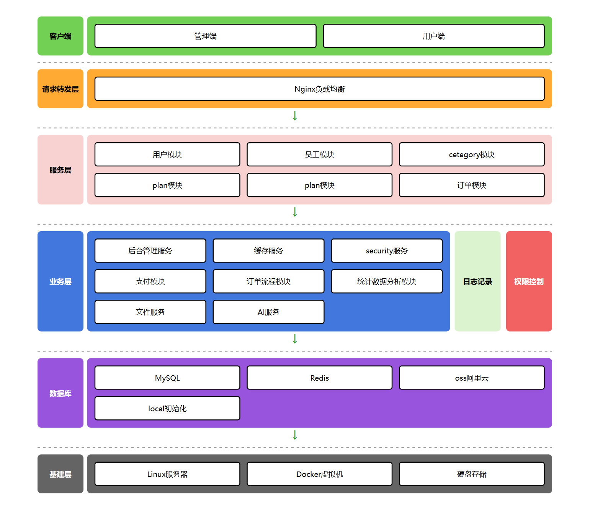 |
| -------- | ------------------------------------------------------------ |
| 总体设计 | 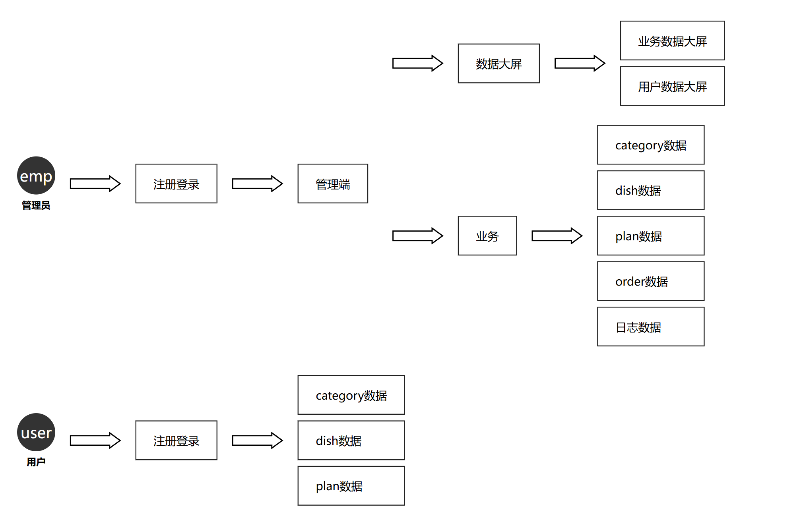 |

**订单状态流转**：

```
1 待支付 → 2 待商家接单 → 3 制作中 → 4 待骑手取餐 → 5 配送中 → 6 已送达 → 7 已完成
        	↓                                      
   8 已取消（未接单退款、商家拒单、超时取消、售后全额退款）
```

**支付流程**：

| 集成到订单 | 支付过程 | 同步支付成功 | 异步检验 |
| :--: | :--: | ---- | ---- |
| 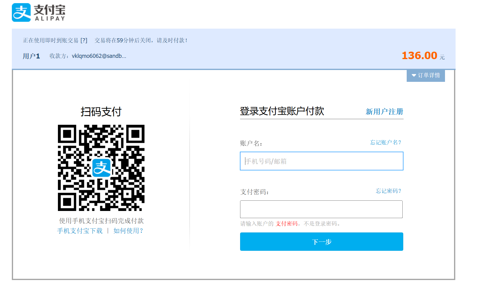 | 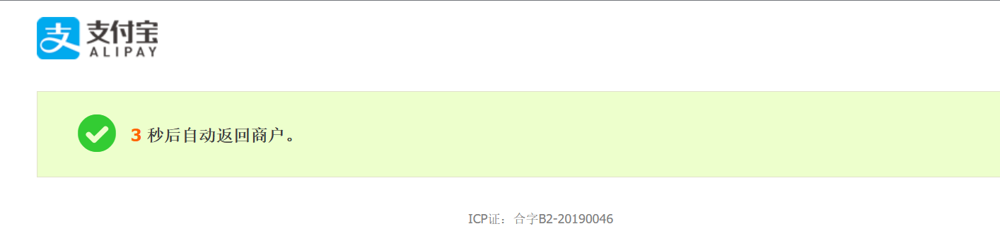 | 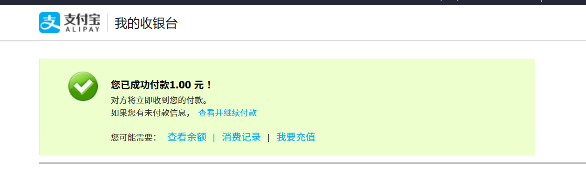 |  |

**第三方授权登录流程图**

| 1                                                            | 2                                                            |
| ------------------------------------------------------------ | ------------------------------------------------------------ |
| 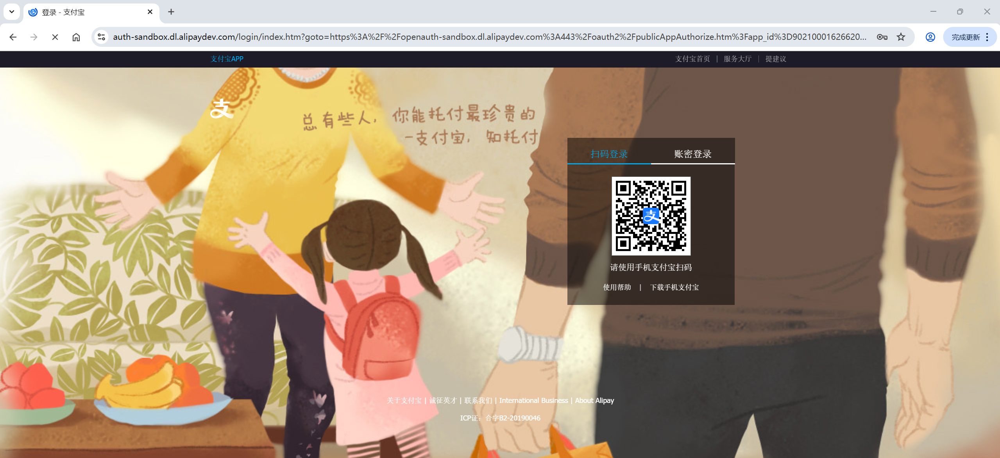 |  |

# 启动步骤

1. 创建数据库并导入 `sql/` 目录脚本。
2. 修改 `start/src/main/resources/application-dev.yml` 中数据库与 Redis 配置。
3. `npm run dev ` 前端启动服务。

# 项目结构

```
restaurant-payment/
├── backend-spring-restaurant/            # 后端代码（Spring Boot 3 多模块）
│   ├── common/                           # 公共模块
│   ├── model/                            # 实体与数据传输对象
│   ├── mapper/                           # 数据访问层（MyBatis-Plus）
│   ├── service/                          # 业务逻辑模块
│   ├── start/                            # 主业务启动模块
│   └── ai-see/                           # AI视觉识别服务（独立服务）
│
├── frontend-vue-admin-restaurant/        # 前端管理端（Vue 3）
│   ├── src/
│   │   ├── api/                          # API接口封装（axios）
│   │   ├── views/                        # 页面视图
│   │   ├── layout/                       # 布局组件
│   │   ├── router/                       # 路由配置(router)
│   │   ├── stores/                       # 状态管理（Pinia）
│   │   └── utils/                        # 工具函数
│   └── package.json
│
├── database-sql/                         # 数据库脚本目录
│   ├── sql.txt                           # 数据库create table
│	├── sql插入数据.txt                    # 数据库初始化SQL
│   └── 数据库设计文档.md                   # 数据库设计说明
│
└── 说明/                                # 项目说明文档
    ├── 原型功能/                         # 前端原型截图
    ├── 支付宝，qq授权登录/                # 支付宝/QQ 授权登录截图
    └── 支付功能结果/                  # 支付流程截图
```

---
#  能力全揽

| 能力域   | 能力说明                                                     |
| -------- | ------------------------------------------------------------ |
| 平台管理 | 员工管理、用户管理、权限拦截、登录校验、异常统一处理。       |
| 商品管理 | 分类管理、dish管理、组合套餐管理、上下架与列表检索。         |
| 交易链路 | 购物车、下单、地址簿、优惠券抵扣、订单状态流转。             |
| 数据分析 | 管理端数据大屏、销售排行、订单趋势、用户增长观察。           |
| 智能问答 | 用户上传菜品图片，系统自动识别图片中的食物/饮料，并匹配对应套餐推荐。 |
| 缓存性能 | Redis中间件 + Spring Cache 用于高频访问数据缓存，减少数据库压力。 |
| 可扩展性 | 模块化目录结构与分层设计，支持功能平滑扩展和二次开发。       |
## 1. 管理后台能力

- 用户与员工管理：支持账号维护、状态启停、信息检索与运营分层管理。
- 商品与分类管理：支持菜谱分类、商品信息、套餐组合、批量操作与业务配置。
- 订单运营能力：支持订单明细查看、状态流转（待处理/派送中/完成等）与异常处理。
- 通知触达能力：支持WebSocket，增强用户端消息触达效率。
- 评价治理能力：支持评价列表、回复机制、评价统计看板。

## 2. 用户端能力

- 首页浏览：展示店铺信息、热门套餐、推荐组合及快捷入口。
- 商品消费：支持套餐详情查看、规格组合与加入购物车。
- 交易转化：支持地址管理、优惠券抵扣、订单提交与支付流程承接。
- 订单管理：支持最新订单、历史订单查看、再来一单与状态追踪。
- 用户中心：支持个人资料展示、地址簿、评价记录、订单入口聚合。
- 销量排行：支持日榜、周榜、月榜多维统计浏览，提升选购效率。

## 3. 数据分析能力

- 管理端数据大屏：展示用户数、订单数、营业额、排行等核心经营指标。
- 销量榜单：前台可按时间维度查看高销量果蔬与组合，辅助运营决策。

## 4. 智能助手能力

- ai视觉识别：用户可输入“购买金额，食材选择”等咨询问题。
- 上下文会话：支持连续对话并保留上下文。
- 业务融合：可作为前台浮窗助手，辅助用户提高下单决策效率。

## 5. 工程与技术能力

- 前后端分离架构：后端提供 RESTful API，前端按业务模块调用。
- 统一响应与异常治理：提升接口一致性与排障效率。
- 缓存与数据库协同：兼顾读性能与数据一致性管理。
- 模块化代码组织：便于新增功能、替换组件和持续迭代。

# 前端说明

## 管理端界面

技术栈：Vue 3 + Element Plus + Pinia + Vue Router + Vite

| 功能页面 |                             截图                             |
| :------: | :----------------------------------------------------------: |
| 登录页面 |  |
| 菜谱分类 | 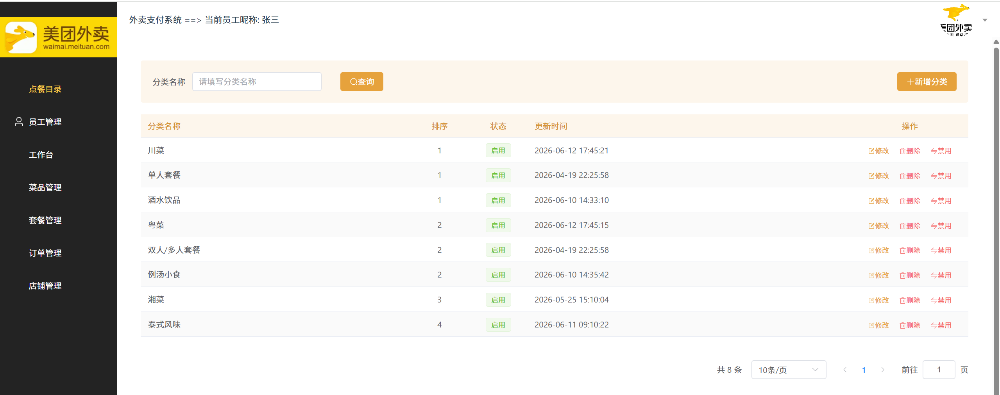 |
| 员工管理 | 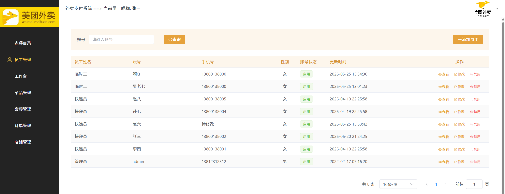 |
|  工作台  | 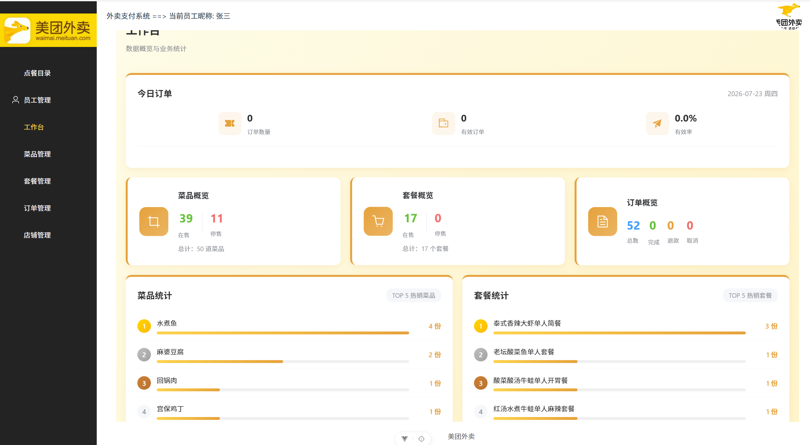 |
| 菜品管理 | 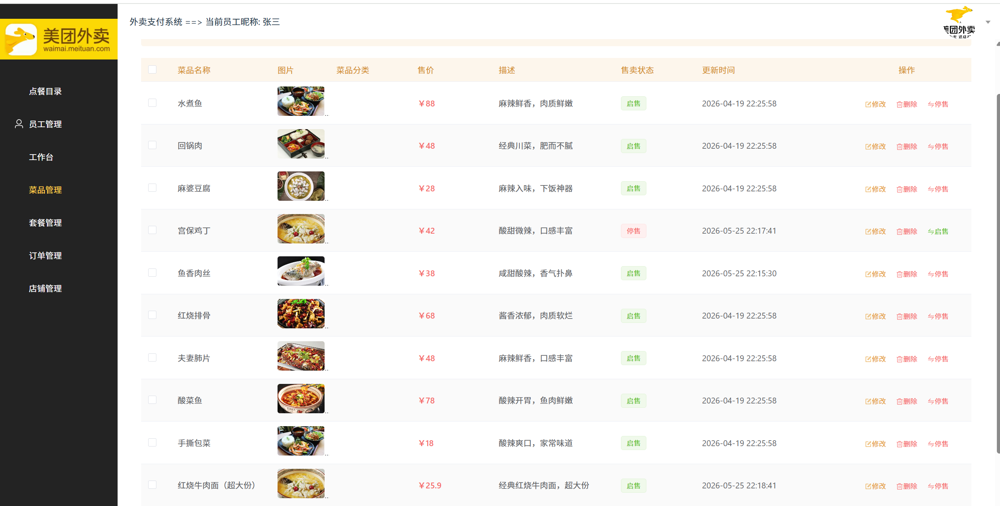 |
| 套餐管理 | 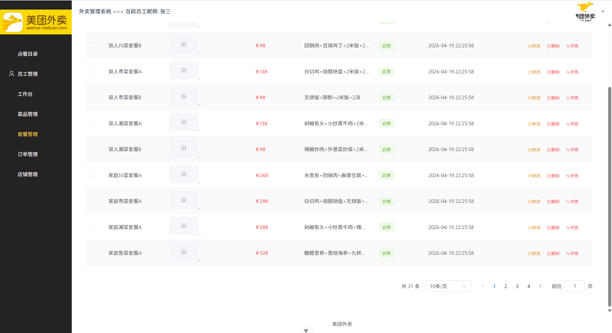 |
| 订单作台 | 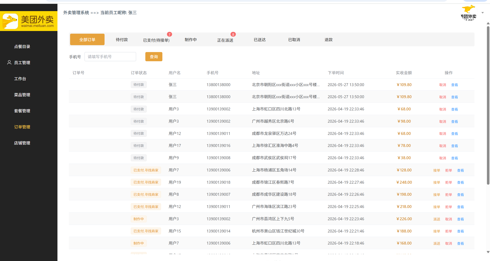 |
| 店铺管理 | 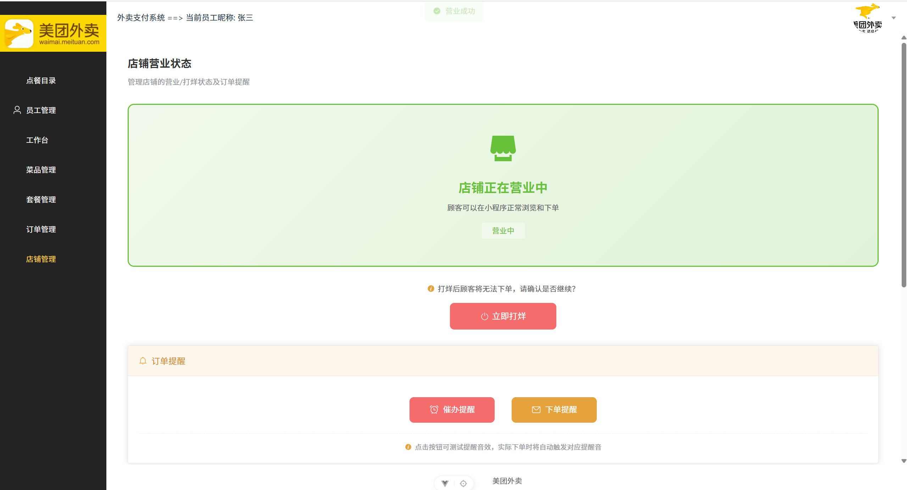 |

## 用户端界面

待完善

# 后端说明

## 一、用户与员工双端登录认证模块

### 需求阶段

需求背景：项目需要同时支撑「管理端员工」和「用户端客户」两套登录体系，且两端的权限、Token、Redis Key 必须互不干扰。

- 传统 Session 认证在前后端分离 + 分布式部署下不好扩展
- 员工端（店长/店员）与用户端（客户）需隔离，避免权限串扰
- 密码明文存储不安全，Token 固定过期会让活跃用户被强制下线

### 策略流程图

```java
员工注册 → AdminEmployeeController/register() → BCrypt加密密码 → MySQL保存 → 返回注册成功
用户注册 → UserController/register()          → BCrypt加密密码 → MySQL保存 → 返回注册成功

员工登录 → AdminEmployeeController/login()
        → 构造 principal="emp:{username}" → AuthenticationManager.authenticate()
        → MultiLoginAuthenticationProvider 按 prefix 区分 emp/user → 查员工表 + BCrypt.matches
        → 生成 JWT(claims: EMP_ID/EMP_NAME/TYPE="emp") → Redis存储("restaurant:emp:{id}")
        → 返回 Token
用户登录 → UserController/login()
        → 构造 principal="user:{username}" → AuthenticationManager.authenticate()
        → MultiLoginAuthenticationProvider 按 prefix 区分 → 查用户表 + BCrypt.matches
        → 生成 JWT(claims: USER_ID/USER_NAME/TYPE="user") → Redis存储("restaurant:user:{id}")
        → 返回 Token

请求拦截 → EmployeeRefreshRequestFilter（仅处理 TYPE=emp，否则放行给 UserFilter）
        → UserRefreshRequestFilter（仅处理 TYPE=user，否则放行）
        → InformationRequestFilter（兜底：未认证返回 401）
        → Redis 校验 Token 一致性 → 滑动过期刷新 → 设置 SecurityContext（ROLE_ADMIN/ROLE_USER）
```
### 编码阶段

```java
// MultiLoginAuthenticationProvider.java - 双端登录认证核心
// 通过 principal 前缀 "emp:" / "user:" 区分员工与用户，复用同一套 AuthenticationManager
@Override
public Authentication authenticate(Authentication authentication) throws AuthenticationException {
    String principal = authentication.getName();
    String password = (String) authentication.getCredentials();

    int idx = principal.indexOf(':');
    String type = idx > 0 ? principal.substring(0, idx) : "user";  // 默认按 user 处理
    String username = idx > 0 ? principal.substring(idx + 1) : principal;

    // ===== emp 员工登录 =====
    if ("emp".equals(type)) {
        Employee employee = employeeService.findEmployeename(username);
        if (employee == null || !passwordEncoder.matches(password, employee.getPassword())) {
            throw new BadCredentialsException("用户名或密码错误");
        }
        return new UsernamePasswordAuthenticationToken(
                new LoginPrincipal(employee.getId(), employee.getUsername(), "emp"),
                null,
                Collections.singletonList(new SimpleGrantedAuthority("ROLE_ADMIN")));
    }
    // ===== user 普通用户登录 =====
    User user = userService.findUsername(username);
    if (user == null || !passwordEncoder.matches(password, user.getPassword())) {
        throw new BadCredentialsException("用户名或密码错误");
    }
    return new UsernamePasswordAuthenticationToken(
            new LoginPrincipal(user.getId(), user.getUsername(), "user"),
            null,
            Collections.singletonList(new SimpleGrantedAuthority("ROLE_USER")));
}
```

```java
// UserRefreshRequestFilter.java - user Token 校验与滑动过期（emp Token 直接放行给下一个过滤器）
// 核心流程：提取 Bearer Token → 解析 JWT → TYPE≠user 放行 → Redis 校验一致性
//          → 设置 SecurityContext(ROLE_USER) → 滑动过期刷新
@Override
protected void doFilterInternal(HttpServletRequest request, HttpServletResponse response, FilterChain filterChain) {
    String token = extractToken(request);                 // 从 "Authorization: Bearer xx" 提取
    if (token == null) { filterChain.doFilter(request, response); return; }   // 无 Token 交给兜底过滤器

    Map<String, Object> claims = JwtUtil.parseJWT(jwtProperties.getUserSecretKey(), token);
    String type = claims.get(JwtConstant.TYPE) != null
            ? claims.get(JwtConstant.TYPE).toString() : "user";
    if (!"user".equals(type)) {                           // 非 user Token（emp）→ 交给 EmployeeRefreshRequestFilter
        filterChain.doFilter(request, response);
        return;
    }
    Long userId = Long.parseLong(claims.get(JwtConstant.USER_ID).toString());

    // Redis 校验：防止 Token 被盗用后多端登录
    String standardToken = stringRedisTemplate.opsForValue()
            .get(RedisPrefixConstant.USER_AUTHHEADER_PREFIX + userId);
    if (!token.equals(standardToken)) {
        response.setStatus(HttpServletResponse.SC_UNAUTHORIZED);
        return;
    }
    // 设置 SecurityContext（ROLE_USER）
    SecurityContextHolder.getContext().setAuthentication(new UsernamePasswordAuthenticationToken(
            new LoginPrincipal(userId, "", "user"), token,
            Collections.singletonList(new SimpleGrantedAuthority("ROLE_USER"))));
    // 滑动过期：每次请求刷新 Redis 中 Token 有效期
    stringRedisTemplate.expire(RedisPrefixConstant.USER_AUTHHEADER_PREFIX + userId,
            jwtProperties.getUserTtl(), TimeUnit.SECONDS);
    // 省略：ExpiredJwtException / JwtException 异常统一捕获并返回 401
}
```

### 问题修复阶段

Q：单过滤器处理双端 Token?

```java
// 其他人写法 - 混乱！
public class SingleFilter extends OncePerRequestFilter {
    protected void doFilterInternal(...) {
        // 一个过滤器里 if-else 判断 user/emp，逻辑耦合，难以维护
        if (type.equals("user")) { ... }
        else if (type.equals("emp")) { ... }
    }
}
```

> 本项目改进：拆为 `UserRefreshRequestFilter` + `EmployeeRefreshRequestFilter` 两个过滤器，各自只处理自己类型的 Token，非自己类型的直接放行。职责单一，互不干扰。

Q：双端登录认证时，如何避免两个 RefreshRequestFilter 都尝试解析同一个 Token 导致重复验证？

> **过滤器短路执行机制**：关键是利用 `filterChain.doFilter()` 的短路特性。在 `EmployeeRefreshRequestFilter` 中，先解析 Token 的 TYPE 字段：如果是 `emp` 类型，执行完整验证流程并设置 SecurityContext；如果不是，直接调用 `filterChain.doFilter()` 放行给下一个过滤器。`UserRefreshRequestFilter` 同样逻辑处理 `user` 类型。只有当两个过滤器都处理完，`InformationRequestFilter` 兜底检查 SecurityContext 是否为空。这种设计的关键是**每个过滤器只处理自己关心的 Token 类型，不做拒绝判断**，避免了 if-else 嵌套和 Token 类型转换错误。

Q：滑动过期策略下，长时间不活跃的用户会被强制下线。系统如何检测并处理已下线用户的后续请求？

> **SecurityContext 缺失检测**：当用户 Token 过期后，`Redis` 中的 Key 自动过期。此时 `RefreshRequestFilter` 解析 Token 成功（JWT 本身未过期），但 Redis 查询返回 null。代码中通过 `stringRedisTemplate.hasKey()` 判断 Token 是否存在，不存在则直接返回 401 错误。这种设计的核心是**双重检查**：JWT 签名验证 + Redis Token 存在性校验。即使 JWT 本身未过期，但只要 Redis 中的 Token 被删除（过期或主动登出），用户就会被强制下线。这为"管理员强制踢出"提供了实现基础——只需从 Redis 删除指定用户的 Token，该用户的所有后续请求都会被拒绝。

---

## 二、分类管理模块

### 需求阶段

需求背景：菜品和套餐都需要分类管理，分类数据相对稳定但访问频繁，是典型的「读多写少」场景。

- 分类数量较少但查询频率高，每次查库浪费
- 菜品分类（type=1）与套餐分类（type=2）共用一张 `restaurant_category` 表，需按 type 区分缓存
- 分类修改后需要及时同步到缓存，避免脏数据

### 策略流程图

```java
查询分类（按type） → CategoryController/readByType()
    ├─ @Cacheable(key="#type") 命中缓存 → 直接返回 Redis 数据
    └─ 未命中 → 查询 MySQL → 结果写入 Redis（cacheName::type） → 返回
新增分类 → AdminCategoryController/create() → 写 MySQL → 返回
更新分类 → AdminCategoryController/update() → @CacheEvict(allEntries=true) 写 MySQL → 清空整个缓存
删除分类 → AdminCategoryController/delete() → @CacheEvict(allEntries=true) 删 MySQL → 清空整个缓存
```

### 编码阶段

```java
// AdminCategoryController.java - Spring Cache 声明式缓存 + @OperationLogging 审计
// @CacheConfig 在类级别统一声明 cacheNames，方法级只用 key
@RestController
@RequestMapping("/admin/category")
@CacheConfig(cacheNames = "restaurantCategory:type")
public class AdminCategoryController {

    @OperationLogging(operation = OperationEnum.CREATE)
    @PostMapping
    public Result create(@RequestBody RestaurantCategoryDTO dto) { ... }

    // 分页查询：type + status(启用) + name 模糊筛选
    @OperationLogging(operation = OperationEnum.READ)
    @GetMapping("/all")
    public Result readAll(CategoryPageDTO dto) { ... }

    // 按 type 查询：结果缓存，key 用 SpEL 引用方法参数 #type
    @OperationLogging(operation = OperationEnum.READ)
    @Cacheable(key = "#type")
    @GetMapping
    public Result readByType(@RequestParam("type") Long type) {
        return Result.success(restaurantCategoryService.lambdaQuery()
                .eq(RestaurantCategory::getType, type).list());
    }

    // 更新/删除：写库后 @CacheEvict(allEntries=true) 清空整个命名空间，保证一致性
    @OperationLogging(operation = OperationEnum.UPDATE)
    @CacheEvict(allEntries = true)
    @PutMapping
    public Result update(@RequestBody RestaurantCategoryDTO dto) { ... }

    @OperationLogging(operation = OperationEnum.DELETE)
    @CacheEvict(allEntries = true)
    @DeleteMapping
    public Result delete(@RequestParam List<Long> ids) { ... }
}
```

```java
// RedisConfig.java - Redis 缓存管理器（@EnableCaching + 自定义 ObjectMapper）
// 关键：克隆 Web 层 ObjectMapper，激活默认类型（写入 @class），配合
//      GenericJackson2JsonRedisSerializer，才能在反序列化时还原对象的实际类型
@Configuration
@EnableCaching
public class RedisConfig {

    private ObjectMapper buildRedisObjectMapper(ObjectMapper webMapper) {
        ObjectMapper redisMapper = webMapper.copy();           // 与 Web 层完全隔离
        PolymorphicTypeValidator typeValidator = BasicPolymorphicTypeValidator.builder()
                .allowIfSubType("pojo.").allowIfSubType("common.")
                .allowIfSubType("model.").allowIfSubType("java.util.")
                .allowIfSubType("java.lang.").build();
        redisMapper.activateDefaultTyping(typeValidator,
                ObjectMapper.DefaultTyping.NON_FINAL, JsonTypeInfo.As.PROPERTY);  // 写入 @class
        return redisMapper;
    }

    @Bean
    public RedisCacheManager cacheManager(RedisConnectionFactory connectionFactory, ObjectMapper objectMapper) {
        RedisCacheConfiguration defaultConfig = RedisCacheConfiguration.defaultCacheConfig()
                .serializeKeysWith(RedisSerializationContext.SerializationPair
                        .fromSerializer(new StringRedisSerializer()))
                .serializeValuesWith(RedisSerializationContext.SerializationPair
                        .fromSerializer(new GenericJackson2JsonRedisSerializer(buildRedisObjectMapper(objectMapper))))
                .entryTtl(Duration.ofMinutes(30));   // 默认缓存 30 分钟
        return RedisCacheManager.builder(connectionFactory).cacheDefaults(defaultConfig).build();
    }
}
```

### 问题修复阶段

Q：分类更新/删除为什么用 @CacheEvict(allEntries=true) 而不是逐个删 key？

> 分类按 type 分组查询（`restaurantCategory:type::{type}`），改动任意一个分类都可能影响多个 type 下的分类列表，无法精确枚举受影响的 key，直接清空整个命名空间最保险。底层 `RedisCache.clear()` 用 `SCAN` 遍历删除该 cacheName 下所有 key（而非阻塞的 `KEYS`）；分类 key 只有几个 type，开销可忽略。

Q：菜品/套餐用"逻辑过期 + 分布式锁"，为什么分类直接用 @Cacheable 声明式缓存？

> 分类是数据量极小、读多写少的数据字典（type=1 菜品 / type=2 套餐各几个），命中率接近 100%，用 Spring Cache 声明式注解成本最低；即使缓存偶发失效也只是一次查库，无性能压力。菜品/套餐是热点商品，需要精细控制**防穿透/击穿/雪崩**，所以手写 Redis + Redisson。两种策略体现了缓存方案按"数据热度"分级取舍。

---

## 三、菜品管理模块

### 需求阶段

需求背景：菜品是餐馆核心商品，需要支持菜品 CRUD、菜品口味（多口味）、按分类查询、起售/停售等。

- 菜品数据量大，分页查询性能要求高
- 一个菜品对应多个口味（DishDetail），需主子表关联
- 菜品与分类关联，按分类检索是高频查询

### 策略流程图

```
// 实体关系：category-->dishs 1:N dishDetail
```

```java
【新增流程】
用户请求 → AdminDishController/create()
    → DishDTO 转 Dish 实体 → dishService.save(dish) → MySQL 保存主表
    → DishDetail DTO 列表转实体 → dishDetailService.saveBatch() → MySQL 批量保存口味
    → @Transactional 事务提交 → 返回成功

【查询流程】
用户请求 → DishController/readAll()
    → LambdaQueryWrapper 构建查询（状态=启用 + 名称模糊匹配）
    → new Page() 分页参数 → dishService.page() → 返回分页数据

详情查询 → DishController/readById()
    → dishService.readCache(id) → Redis 查缓存
    ├─ 缓存存在且逻辑未过期 → 直接返回缓存数据
    ├─ 缓存存在但逻辑过期 → 异步线程池获取分布式锁 → 刷新缓存 → 返回旧数据
    └─ 缓存不存在 → 查询数据库 → 写入 RedisData → 返回

【更新流程】
用户请求 → AdminDishController/update()
    → dishService.updateCache(dishDTO)
    → BeanUtil 转实体 → super.updateById() → 更新 MySQL
    → stringRedisTemplate.delete() → 主动删除缓存（保证一致性）
    → 清空旧口味 → 批量保存新口味 → @Transactional 提交

【删除流程】
用户请求 → AdminDishController/delete()
    → super.removeByIds(ids) → 删除主表
    → dishDetailService.remove() → 批量删除关联口味
    → for 循环 delete() → 删除所有缓存 Key
    → 返回成功
```

### 编码阶段

```java
// AdminDishController.java - 管理端菜品 CRUD
// 核心设计：主表+明细表同一事务保存；写操作同步清缓存（Cache Aside）保证一致性
@RestController
@RequestMapping("/admin/dish")
public class AdminDishController {

    @OperationLogging(operation = OperationEnum.CREATE)
    @Transactional(rollbackFor = Exception.class)
    @PostMapping
    public Result create(@RequestBody DishDTO dishDTO) {
        Dish dish = BeanUtil.toBean(dishDTO, Dish.class);
        dishService.save(dish);
        dishService.deleteCacheById(dish.getId());   // 清除可能残留的空值缓存（防穿透）
        // 批量保存口味列表（saveBatch 比循环 insert 性能高数十倍）
        List<DishDetail> dishDetailList = dishDTO.getDishDetails().stream()
                .map(dishDetail -> BeanUtil.toBean(dishDetail, DishDetail.class))
                .toList();
        dishDetailService.saveBatch(dishDetailList);
        return Result.success(OperationEnum.CREATE + "--" + dish.getId());
    }

    // 分页查询：支持状态筛选+名称模糊搜索
    @OperationLogging(operation = OperationEnum.READ)
    @GetMapping("/all")
    public Result readAll(DishPageDTO dishPageDTO) { ... }

    // 详情查询：缓存优先（readCache），空值返回"菜品不存在"
    @OperationLogging(operation = OperationEnum.READ)
    @GetMapping
    public Result readById(@RequestParam Long id) {
        Dish dish = dishService.readCache(id);   // 带缓存的读取（逻辑过期+异步刷新）
        if (dish == null) return Result.error("菜品不存在");
        return Result.success(dish + "::" + dishDetailService.lambdaQuery()
                .eq(DishDetail::getDishId, dish.getId()).list());
    }

    @OperationLogging(operation = OperationEnum.UPDATE)
    @PutMapping
    public Result update(@RequestBody DishDTO dishDTO) {
        dishService.updateCache(dishDTO);
        return Result.success(OperationEnum.UPDATE + "--" + dishDTO.getId());
    }

    @OperationLogging(operation = OperationEnum.DELETE)
    @DeleteMapping
    public Result delete(@RequestParam List<Long> ids) {
        dishService.deleteCache(ids);
        return Result.success(OperationEnum.DELETE + "--" + ids);
    }
}
```

```java
// DishServiceImpl.java - 菜品三级缓存策略（防穿透 / 防击穿 / 防雪崩）
// RedisData 结构：{ data: 实际数据, expireTime: 逻辑过期时间 }
// 常量：PLUS_TTL=30s（逻辑过期）、FINAL_TTL=86400s（物理 TTL）、RENEW_TTL=10s（续期阈值）
// 防雪崩：物理 TTL 24h 远大于逻辑过期，写缓存时逻辑过期时间再加随机 ±5s
@Service
public class DishServiceImpl extends ServiceImpl<DishMapper, Dish> implements DishService {

    public Dish readCache(Long id) {
        String value = stringRedisTemplate.opsForValue().get(DISH_PREFIX + id);
        if (value == null) return getDishLock(id);        // ① 无缓存：加锁查库重建

        RedisData redisData = JSONUtil.toBean(value, RedisData.class);
        // ② 逻辑未过期：直接返回；空值缓存返回 null（防穿透，不查库）；临近过期(<10s)同步续期
        if (redisData.getExpireTime().isAfter(LocalDateTime.now())) {
            if (redisData.getData() == null) return null;   // 空值缓存，直接返回，不查库
            long remainSec = Duration.between(LocalDateTime.now(), redisData.getExpireTime()).getSeconds();
            if (remainSec < RENEW_TTL) redisData.setExpireTime(LocalDateTime.now().plusSeconds(PLUS_TTL));  // 续期
            return BeanUtil.toBean(redisData.getData(), Dish.class);
        }
        // ③ 逻辑过期：返回旧数据，异步线程池重建缓存（防击穿，不阻塞请求线程）
        dishCache(id);
        return redisData.getData() == null ? null : BeanUtil.toBean(redisData.getData(), Dish.class);
    }

    // 缓存穿透 + 防雪崩：查不到也缓存空值（data=null）；逻辑过期时间加入随机 ±5s
    private Dish getDish(Long id) {
        Dish dish = super.getById(id);
        RedisData redisData = new RedisData();
        redisData.setData(dish);                        // dish==null 时即为空值缓存
        redisData.setExpireTime(LocalDateTime.now().plusSeconds(PLUS_TTL + RANDOM.nextInt(-5, 5)));
        stringRedisTemplate.opsForValue().set(DISH_PREFIX + id, JSONUtil.toJsonStr(redisData),
                FINAL_TTL, TimeUnit.SECONDS);
        return dish;
    }

    // 防击穿（无缓存时）：Redisson 分布式锁 + 双重检查，保证并发下只有一线程查库
    private Dish getDishLock(Long id) {
        RLock lock = redissonClient.getLock("dish:lock:" + id);
        if (!lock.tryLock(10, TimeUnit.SECONDS)) return null;
        try {
            String latest = stringRedisTemplate.opsForValue().get(DISH_PREFIX + id);
            if (latest != null) {                        // 双重检查：等锁期间其他线程可能已重建
                RedisData cached = JSONUtil.toBean(latest, RedisData.class);
                if (cached.getExpireTime().isAfter(LocalDateTime.now())) {
                    return cached.getData() == null ? null : BeanUtil.toBean(cached.getData(), Dish.class);
                }
            }
            return getDish(id);                          // 真正查库重建
        } finally {
            if (lock.isHeldByCurrentThread()) lock.unlock();
        }
    }

    // 逻辑过期后的异步刷新：有界线程池（核心5/队列100/CallerRunsPolicy）+ 锁 + 双重检查
    private void dishCache(Long id) {
        DISH_EXECUTOR.submit(() -> {
            RLock redissonLock = redissonClient.getLock("dish:lock:" + id);
            if (!redissonLock.tryLock(10, TimeUnit.SECONDS)) return;
            try {
                // 双重检查：等锁后缓存已被其他线程刷新则跳过 ...（省略）
                getDish(id);
            } finally {
                if (redissonLock.isHeldByCurrentThread()) redissonLock.unlock();
            }
        });
    }

    // 写操作：更新数据库 + 重建口味（先删后插），事务提交后再删缓存（Cache Aside）
    @Transactional(rollbackFor = Exception.class)
    public void updateCache(DishDTO dishDTO) {
        super.updateById(BeanUtil.toBean(dishDTO, Dish.class));
        dishDetailService.remove(new LambdaQueryWrapper<DishDetail>()
                .eq(DishDetail::getDishId, dishDTO.getId()));
        dishDetailService.saveBatch(dishDTO.getDishDetails());
        // 事务提交后再删缓存，避免并发读在事务提交前读到旧数据
        TransactionSynchronizationManager.registerSynchronization(new TransactionSynchronization() {
            @Override public void afterCommit() {
                stringRedisTemplate.delete(DISH_PREFIX + dishDTO.getId());
            }
        });
    }
}
```

### 问题修复阶段

Q：缓存刷新用 `synchronized` 或 `ReentrantLock` 替代 Redisson 分布式锁可行吗？

> `synchronized` / `ReentrantLock` 是 JVM 级单机锁，只在单实例内生效；多实例部署时各自持锁，仍可能多个实例同时查库重建。Redisson 分布式锁基于 Redis，跨实例生效，保证全局只有一线程刷新。**本项目用 `lock.tryLock(10, SECONDS)` + 双重检查**：加锁等待后再次读缓存，若其他线程已重建则直接返回，避免重复查库。选型依据是部署架构：单实例可用 `synchronized` 简化，多实例必须分布式锁。

Q：缓存如何处理？

> 使用逻辑缓存，同步路径下用户延迟从 <1ms 涨到数百 ms。改进：核心线程按 CPU 核数 × 2、减小队列让任务尽快拒绝、或对非关键任务用丢弃策略。**本项目把异步刷新与请求解耦**（逻辑过期时同步返回旧数据、异步重建），已规避"请求线程被阻塞"的同步等待问题。

Q：查不到数据为什么也要缓存空值？为什么逻辑过期时间要加随机值？

> ① **空值缓存防穿透**：数据库不存在的 id 每次查询都会打库，把 `data=null` 的空值缓存起来（物理 TTL 24h），后续请求直接返回 null，不再穿透到 MySQL；也正因如此，`create()` 里要先 `deleteCacheById`，防止复用同一 id 时读到旧的空值缓存。② **随机过期防雪崩**：若所有 key 同一瞬间逻辑过期，会同时触发大量异步重建，逻辑过期时间加 `RANDOM.nextInt(-5,5)` 秒把重建压力摊开。

---

## 四、套餐管理模块

### 需求阶段

需求背景：套餐是餐馆的核心商品组合，需要支持套餐 CRUD、套餐菜品关联、按分类查询等功能。套餐由多个菜品组成，一个套餐可包含多种菜品，每个菜品可设定份数。

- 套餐数据需要与菜品表关联，支持多菜品组合
- 套餐状态需要支持启用/停用切换
- 套餐查询需要支持分页和按名称搜索

### 策略流程图

```
// 实体关系：category--> Plan，Plan 1:N PlanDetail，PlanDetail 1:N Dish，多表查询
// PlanDetail通过 plan_id 关联Plan，Dish通过 dish_id 关联PlanDetail, 一个plan可包含多个dish（如：米饭x2、红烧肉x1、青菜x1）
```


```java

【新增流程】
用户请求 → AdminPlanController/create()
    → PlanDTO 转 Plan 实体 → planService.save(plan) → MySQL 保存主表
    → PlanDetail DTO 列表转实体 → planDetailService.saveBatch() → MySQL 批量保存菜品明细
    → @Transactional 事务提交 → 返回成功

【查询流程】
分页查询 → PlanController/readAll()
    → LambdaQueryWrapper 构建查询（状态=启用 + 名称模糊匹配）
    → new Page() 分页参数 → planService.page() → 返回分页数据

详情查询 → AdminPlanController/readById()
    → planService.readCache(id) → Redis 查缓存
    → planDetailService 查询关联菜品明细 → 返回主表+明细

【更新流程】
用户请求 → AdminPlanController/update()
    → planService.updateCache(planDTO)
    → BeanUtil 转实体 → super.updateById() → 更新 MySQL
    → 清空旧菜品明细 → 批量保存新菜品明细 → @Transactional 提交

【删除流程】
用户请求 → AdminPlanController/delete()
    → super.removeByIds(ids) → 删除主表
    → planDetailService.remove() → 批量删除关联菜品明细
    → 返回成功
```

### 编码阶段

```java
// AdminPlanController.java - 套餐管理核心接口
@RestController
@RequestMapping("/admin/plan")
public class AdminPlanController {

    @OperationLogging(operation = OperationEnum.CREATE)
    @Transactional(rollbackFor = Exception.class)
    @PostMapping
    public Result create(@RequestBody PlanDTO planDTO) {
        Plan plan = BeanUtil.toBean(planDTO, Plan.class);
        planService.save(plan);
        planService.deleteCacheById(plan.getId());   // 清除可能残留的空值缓存（防穿透）
        // 批量保存套餐菜品明细
        List<PlanDetail> planDetailList = planDTO.getPlanDetails().stream()
                .map(planDetail -> BeanUtil.toBean(planDetail, PlanDetail.class))
                .toList();
        planDetailService.saveBatch(planDetailList);
        return Result.success(OperationEnum.CREATE + "--" + plan.getId());
    }

    // 分页查询：按状态和名称筛选
    @OperationLogging(operation = OperationEnum.READ)
    @GetMapping("/all")
    public Result readAll(DishPageDTO dishPageDTO) { ... }

    // 查询套餐详情：主表+菜品明细，缓存优先，空值返回"套餐不存在"
    @OperationLogging(operation = OperationEnum.READ)
    @GetMapping
    public Result readById(@RequestParam Long id) {
        Plan plan = planService.readCache(id);   // 缓存读取（逻辑过期+异步刷新）
        if (plan == null) return Result.error("套餐不存在");
        return Result.success(plan + "::" + planDetailService.lambdaQuery()
                .eq(PlanDetail::getPlanId, plan.getId()).list());
    }

    @OperationLogging(operation = OperationEnum.UPDATE)
    @PutMapping
    public Result update(@RequestBody PlanDTO planDTO) {
        planService.updateCache(planDTO);
        return Result.success(OperationEnum.UPDATE + "--" + planDTO.getId());
    }

    @OperationLogging(operation = OperationEnum.DELETE)
    @DeleteMapping
    public Result delete(@RequestParam List<Long> ids) {
        planService.deleteCache(ids);
        return Result.success(OperationEnum.DELETE + "--" + ids);
    }
}
```

```java
// PlanServiceImpl.java - 套餐缓存策略（与菜品完全一致：防穿透/防击穿/防雪崩）
// 关键方法：readCache / getPlan(空值缓存+随机过期) / getPlanLock(锁+双重检查)
//          / planCache(异步刷新) / updateCache(更新+删缓存) / deleteCache(删主表+明细+缓存)
public Plan readCache(Long id) {
    String value = stringRedisTemplate.opsForValue().get(PLAN_PREFIX + id);
    if (value == null) return getPlan(id);                    // ① 无缓存 → 查库重建

    RedisData redisData = JSONUtil.toBean(value, RedisData.class);
    if (redisData.getExpireTime().isAfter(LocalDateTime.now())) {   // ② 逻辑未过期
        if (redisData.getData() == null) return null;          // 空值缓存防穿透，不查库
        long remainSec = Duration.between(LocalDateTime.now(), redisData.getExpireTime()).getSeconds();
        if (remainSec < RENEW_TTL) redisData.setExpireTime(LocalDateTime.now().plusSeconds(PLUS_TTL));  // 续期
        return BeanUtil.toBean(redisData.getData(), Plan.class);
    }
    planCache(id);                                            // ③ 逻辑过期 → 异步刷新
    return redisData.getData() == null ? null : BeanUtil.toBean(redisData.getData(), Plan.class);
}
// 其余方法与 DishServiceImpl 结构一致，注释省略：
//   getPlan(id)      → 空值缓存（data=null）+ 逻辑过期随机 ±5s，防穿透与雪崩
//   getPlanLock(id)  → Redisson 锁 "plan:lock:{id}" + 双重检查，防击穿
//   planCache(id)    → 有界线程池（核心5/队列100/CallerRunsPolicy）异步刷新
//   updateCache(dto) → 更新 MySQL → 删缓存 → 重建明细（先删后插）
//   deleteCache(ids) → 删主表 + 删明细 + 批量删缓存
```

### 问题修复阶段

Q：更新套餐"先删后插"全量替换明细，并发更新会导致什么问题？

> 请求 A、B 同时更新同一套餐时可能互相覆盖明细（A 删旧明细 → B 也删 → A 插新明细 → B 插新明细，结果混合错乱）。当前 `updateCache` 在同一 `@Transactional` 内"删旧插新"，事务隔离保证单请求原子，但两个并发请求之间没有串行化，**仍存在竞态窗口**。改进：① `plan` 表加 `version` 字段做乐观锁；② `RedissonClient.getLock("plan:update:{id}")` 串行化更新；③ `plan_detail` 加 `(plan_id, dish_id)` 联合唯一索引兜底。

Q：PlanDetailService.saveBatch() 批量保存时，如果中间某条保存失败，会导致数据不一致吗？

> 不会。`@Transactional(rollbackFor = Exception.class)` 把主表 + 明细全部包进同一事务，任意一条失败整体回滚。注意 `rollbackFor = Exception.class` 的必要性：Spring 默认只在 `RuntimeException` 时回滚，受检异常需显式声明。`saveBatch()` 默认批量 1000，超过会分批执行，但仍在同一事务内。

---
## 五、收货地址模块
目前还未开发
## 六、用户购物车模块
目前还未开发
## 七、支付系统模块

沙箱环境提供真实的支付宝 API 接口但使用测试账号，不会产生真实资金，用于开发联调。生产环境需替换为正式 APPID、应用私钥、支付宝公钥。

### 需求阶段

需求背景：订单支付是餐饮系统的资金入口，需对接第三方支付。项目选择支付宝电脑网站支付（沙箱环境），支持下单、查询、退款、关单、OAuth 授权登录。

- 支付流程涉及同步跳转（用户可见）和异步通知（服务端验签），两者职责不同
- 异步通知必须验签，防止伪造请求篡改订单状态
- 退款是逆向流程，需独立的退款查询接口确认到账
- 第三方授权登录支持支付宝，可扩展 QQ、微信等其他平台

### 策略流程图

```java
【电脑网站支付】
用户请求 → GET /pay/order → AlipayService.createPagePayForm()
    → 构造 AlipayTradePagePayRequest（out_trade_no / total_amount / subject / product_code=FAST_INSTANT_TRADE_PAY）
    → 设置 notifyUrl（异步）+ returnUrl（同步）+ timeout_express=60m
    → 返回支付宝收银台 HTML 表单 → 浏览器跳转收银台

【同步跳转】
GET /pay/return → 用户支付成功后跳回商户页面

【交易查询】
GET /pay/order/query?outTradeNo → AlipayService.queryTrade() → 返回交易状态

【退款 / 退款查询】
POST /pay/refund → AlipayService.refund() → 构造 AlipayTradeRefundRequest → 退款
GET /pay/refund/query?outTradeNo&outRequestNo → AlipayService.refundQuery() → 确认退款到账

【关闭交易】
POST /pay/order/close?outTradeNo → AlipayService.close() → 超时未支付关闭交易

【OAuth 授权登录】
GET /oauth/authorize?redirectUri → 302 跳转支付宝授权页
GET /oauth/callback?auth_code → auth_code 换 access_token / refresh_token → 拉取用户资料
```

### 编码阶段

```java
// PayTest.java - 支付接口入口（电脑网站支付 / 交易查询 / 退款 / 退款查询 / 关单 / 同步跳转）
@RestController
@RequestMapping("/pay")
public class PayTest {

    @Autowired
    private AlipayService alipayService;

    // 电脑网站支付：浏览器打开此接口会跳转到支付宝沙箱收银台
    @GetMapping("/order")
    public void orderPay(PayDTO payDTO, HttpServletResponse response) throws Exception {
        String form = alipayService.createPagePayForm(payDTO);
        response.setCharacterEncoding(StandardCharsets.UTF_8.name());
        response.setContentType("text/html;charset=UTF-8");
        response.getWriter().write(form);   // 输出支付宝收银台 HTML 表单
        response.getWriter().flush();
    }

    // 交易查询
    @GetMapping("/order/query")
    public AlipayTradeQueryResponse queryOrder(@RequestParam String outTradeNo) throws Exception {
        return alipayService.queryTrade(outTradeNo);
    }

    // 退款
    @PostMapping("/refund")
    public AlipayTradeRefundResponse refundOrder(RefundDTO refundDTO) throws Exception {
        return alipayService.refund(refundDTO);
    }

    // 退款查询
    @GetMapping("/refund/query")
    public AlipayTradeFastpayRefundQueryResponse refundQuery(
            @RequestParam String outTradeNo, @RequestParam String outRequestNo) throws Exception {
        return alipayService.refundQuery(outTradeNo, outRequestNo);
    }

    // 关闭交易
    @PostMapping("/order/close")
    public AlipayTradeCloseResponse close(@RequestParam String outTradeNo) throws Exception {
        return alipayService.close(outTradeNo);
    }

    // 同步跳转：支付成功后跳回商户页面
    @GetMapping("/return")
    public String returnUrl() {
        return "已返回商户页面,同步返回。";
    }
}
```

```java
// AlipayService.java - 支付宝核心服务（5 个操作全部实现）
public String createPagePayForm(PayDTO payDTO) throws AlipayApiException {
    Map<String, Object> bizContent = new LinkedHashMap<>();
    bizContent.put("out_trade_no", payDTO.getOutTradeNo());
    bizContent.put("total_amount", payDTO.getTotalAmount().toPlainString());
    bizContent.put("subject", payDTO.getSubject());
    bizContent.put("product_code", "FAST_INSTANT_TRADE_PAY");
    bizContent.put("timeout_express", "60m");
    AlipayTradePagePayRequest request = new AlipayTradePagePayRequest();
    request.setNotifyUrl(alipayProperties.getNotifyUrl());   // 异步通知地址
    request.setReturnUrl(alipayProperties.getReturnUrl());   // 同步通知地址
    request.setBizContent(toJson(bizContent));
    return getClient().pageExecute(request).getBody();
}
```

```java
// OAuthLogin.java - 支付宝授权登录
// ① GET /oauth/authorize → 302 跳转支付宝授权页
@GetMapping("/authorize")
public void authorize(@RequestParam String redirectUri, HttpServletResponse response) throws IOException {
    String authorizeUrl = AUTHORIZE_URL
            + "?app_id=" + alipayProperties.getAppId()
            + "&redirect_uri=" + URLEncoder.encode(redirectUri, StandardCharsets.UTF_8)
            + "&scope=auth_user";
    response.sendRedirect(authorizeUrl);   // 302 重定向
}

// ② GET /oauth/callback?auth_code= → auth_code 换 access_token，并拉取用户资料
@GetMapping("/callback")
public Map<String, Object> callback(@RequestParam("auth_code") String authCode) throws AlipayApiException {
    AlipaySystemOauthTokenRequest tokenReq = new AlipaySystemOauthTokenRequest();
    tokenReq.setCode(authCode);
    tokenReq.setGrantType("authorization_code");
    AlipaySystemOauthTokenResponse tokenResp = client.execute(tokenReq);
    // accessToken 有效期 3600s，refreshToken 有效期 30 天
    AlipayUserInfoShareRequest userReq = new AlipayUserInfoShareRequest();
    userReq.putOtherTextParam("auth_token", tokenResp.getAccessToken());
    AlipayUserInfoShareResponse userResp = client.execute(userReq);
    // 返回 openId / accessToken / refreshToken / 昵称 / 头像 / 性别 / 邮箱
}
```

### 问题修复阶段

Q：异步通知（/pay/notify）应该校验哪些值？

> 支付宝异步通知是服务端对支付结果唯一可信的确认，必须做以下几重校验，否则可能被伪造请求篡改订单状态：
> 1. **验签**：`AlipaySignature.rsaCheckV1(params, alipayPublicKey, charset, signType)`，验签失败返回 `failure`；
> 2. **app_id 校验**：通知中的 `app_id` 必须与商户配置一致；
> 3. **金额校验**：通知中的 `total_amount` 必须与数据库订单金额一致（用 BigDecimal 精确比较），防止篡改金额；
> 4. **幂等校验**：订单状态已是"已支付"则跳过，避免重复处理。
>
> **注意**：`/pay/notify` 异步通知接口因依赖订单服务（OrderService）尚未实现，代码已写好但被注释，待订单模块落地后启用；验签失败返回 `failure` 让支付宝重试，避免丢失通知。

Q：同步跳转 /pay/return 和异步通知 /pay/notify 有什么区别？为什么以异步通知为准？

> 同步跳转只是支付宝把用户浏览器重定向回商户页面，用户可能中途关闭浏览器，**不能作为支付成功的依据**；异步通知是支付宝服务端主动 POST 到 `notifyUrl`，**必须验签 + 校验 app_id/金额 + 幂等**后才更新订单状态。本项目同步返回只提示"已返回商户页面"，真实订单状态更新逻辑在（已注释、待订单模块落地后启用的）异步通知中实现。

---


## 八、文件上传与 Excel 导出模块

### 需求阶段

需求背景：菜品图片、员工头像、用户头像需要上传；运营需要导出用户数据为 Excel 报表。

- 本地存储在多实例部署时文件不一致
- 大文件上传需限制大小（10MB）
- Excel 导出需支持流式下载，避免内存溢出

### 策略流程图

```
文件上传（本地） → POST /local → UUID生成文件名 → 保存到 ku/image 目录 → 返回本地路径
文件上传（OSS）  → POST /oss  → UUID生成文件名 → AliOssUtil上传到阿里云 → 返回 CDN URL
文件下载（本地） → GET /local?fileName= → 读取本地文件 → Content-Disposition → 返回流
文件下载（OSS）  → GET /oss?url= → 从 OSS URL 拉取字节流 → 返回 ResponseEntity<byte[]>
Excel 导出       → POST /report/excel/write → EasyExcel.write → 写入 report.xlsx
Excel 读取       → POST /report/excel/read  → EasyExcel.read → AnalysisEventListener 解析
Excel 下载       → GET /report/excel/download → 流式下载
```

### 编码阶段

```java
// FileController.java - 本地文件上传/下载（UUID 防冲突 + URLEncoder 防中文乱码）
@RestController
@RequestMapping("/local")
@Slf4j
public class FileController {
    private static final String PATH = "ku/image";

    @PostMapping
    public Result upload(MultipartFile file) {
        String originalFilename = file.getOriginalFilename();
        File path = new File(new File(PATH).getAbsolutePath());
        if (!path.exists()) path.mkdirs();
        // UUID + 原扩展名，避免文件名冲突和文件遍历攻击
        String saveName = UUID.randomUUID().toString() +
                originalFilename.substring(originalFilename.lastIndexOf("."));
        file.transferTo(new File(path, saveName));
        return Result.success(path + "::" + saveName);
    }

    @GetMapping
    public void download(String fileName, HttpServletResponse response) {
        File path = new File(new File(PATH).getAbsolutePath(), fileName);
        response.setContentType("application/octet-stream");
        // 中文文件名用 URLEncoder 编码，避免下载乱码
        response.setHeader("Content-Disposition", "attachment;filename=" +
                URLEncoder.encode(fileName, StandardCharsets.UTF_8));
        try (InputStream in = new FileInputStream(path)) {
            StreamUtils.copy(in, response.getOutputStream());
        } // ... 省略：文件不存在校验与 IOException 处理
    }
}
```

```java
// AliOssUtil.java - 阿里云 OSS 上传（配置由 AliOssProperties 注入）
@Component
public class AliOssUtil {
    @Autowired
    private AliOssProperties aliOssProperties;

    public String uploadFile(String objectName, InputStream inputStream) {
        OSS ossClient = new OSSClientBuilder().build(
                aliOssProperties.getEndpoint(),
                aliOssProperties.getAccessKeyId(),
                aliOssProperties.getAccessKeySecret());
        try {
            ossClient.putObject(aliOssProperties.getBucketName(), objectName, inputStream);
        } finally {
            if (ossClient != null) ossClient.shutdown();   // 必须关闭，否则连接泄漏
        }
        // 文件访问路径规则 https://BucketName.Endpoint/ObjectName
        return "https://" + aliOssProperties.getBucketName() + "." +
                aliOssProperties.getEndpoint() + "/" + objectName;
    }
}
```

```java
// OSSFileController.java - 阿里云 OSS 上传/下载（配合 AliOssUtil）
@RestController
@RequestMapping("/oss")
public class OSSFileController {
    @Autowired
    private AliOssUtil aliOss;

    @PostMapping
    public ResponseEntity<Map<String, String>> uploadFile(@RequestParam("file") MultipartFile file) {
        String objectName = UUID.randomUUID().toString() +
                file.getOriginalFilename().substring(file.getOriginalFilename().lastIndexOf("."));
        String url = aliOss.uploadFile(objectName, file.getInputStream());   // 上传 OSS，返回 CDN URL
        return ResponseEntity.ok(Map.of("url", url, "filename", file.getOriginalFilename()));
    }

    @GetMapping
    public ResponseEntity<byte[]> downloadFile(@RequestParam("url") String fileUrl) {
        // 通过 URLConnection 拉取 OSS 字节流，Content-Disposition 返回附件 ...（省略）
    }
}
```

### 问题修复阶段

Q：为啥使用uuid重命名？

> ① UUID 全局唯一，避免文件名冲突——同名文件重复上传不会相互覆盖；② 原文件名可能包含中文、特殊字符或路径分隔符，直接保存存在安全风险（如文件遍历攻击），UUID 重命名后文件名不可预测，无法通过猜测文件名遍历服务器文件。代码中保存为 `UUID.randomUUID().toString() + 原扩展名`。

Q：为什么同时提供本地和 OSS 两种存储？

> 开发/测试环境用本地存储（`ku/image`），简单快捷、零成本；生产环境用阿里云 OSS，支持 CDN 加速、容量无限、多实例共享。**本地存储的已知限制**：多实例部署时各实例本地磁盘不共享，文件互相不可见，生产必须切 OSS。两个 Controller（`/local`、`/oss`）接口独立，互不干扰。

---


## 九、AOP 操作日志模块

### 需求阶段

需求背景：管理端的增删改查操作需记录审计日志，便于追溯谁在什么时间做了什么操作。同时业务方法需记录执行耗时用于性能监控。

- 操作日志需自动记录，不能侵入业务代码
- 需区分操作类型（CREATE/READ/UPDATE/DELETE）
- 需记录操作人、操作结果（成功/失败）、入参

### 策略流程图

```
业务方法标注 @OperationLogging(operation=CREATE)
    → ServiceInterceptAspect 拦截 → 执行目标方法
    ├─ 成功 → OperationType.ok(operation, args) → log.info
    └─ 异常 → OperationType.error(operation, args) → log.info → 异常继续抛出

业务方法标注 @Info(desc="描述")
    → ServiceInterceptAspect 拦截 → 记录目标类/方法/入参/耗时/返回值/异常
```

| 人、操作结果，入参 | 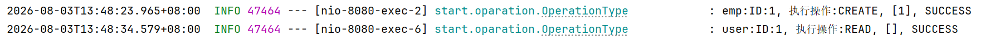 |
| ------------------ | ------------------------------------------------------------ |


### 编码阶段

```java
// OperationLogging.java - 操作日志注解
@Target({ElementType.METHOD})
@Retention(RetentionPolicy.RUNTIME)
public @interface OperationLogging {
    // 操作类型：CREATE / READ / UPDATE / DELETE
    OperationEnum operation() default OperationEnum.CREATE;
}

// Info.java - 方法信息注解
@Target({ElementType.METHOD})
@Retention(RetentionPolicy.RUNTIME)
public @interface Info {
    String desc() default "未描述";        // 方法描述
    boolean recordCostTime() default true; // 是否记录耗时
}
```

```java
// ServiceInterceptAspect.java - 双切面：@Info 耗时监控 + @OperationLogging 操作日志
@Aspect
@Component
@Slf4j
public class ServiceInterceptAspect {

    // 切面①：@Info 注解 - 记录目标类/方法/入参/耗时/返回值/异常（性能监控）
    @Around("@annotation(start.aop.Info)")
    public Object interceptServiceMethod(ProceedingJoinPoint joinPoint) throws Throwable {
        // 省略：解析注解 desc、目标类名/方法名、入参；执行前打点，执行后打印耗时与返回，
        //       异常时打印异常信息并继续抛出
        return joinPoint.proceed();
    }

    // 切面②：@OperationLogging 注解 - 自动记录操作日志（成功/失败）
    @Around("@annotation(start.aop.OperationLogging)")
    public Object interceptOperationLog(ProceedingJoinPoint joinPoint) throws Throwable {
        MethodSignature signature = (MethodSignature) joinPoint.getSignature();
        OperationLogging annotation = signature.getMethod().getAnnotation(OperationLogging.class);
        String operation = annotation.operation().name();  // CREATE/READ/UPDATE/DELETE
        String methodArgs = Arrays.toString(joinPoint.getArgs());
        try {
            Object result = joinPoint.proceed();   // 执行业务方法
            OperationType.ok(operation, methodArgs);   // 成功日志
            return result;
        } catch (Exception e) {
            OperationType.error(operation, methodArgs);  // 失败日志
            throw e;   // 异常继续抛，保证全局异常处理器能处理
        }
    }
}
```

```java
// OperationType.java - 操作日志实体（用 log.info 输出，确保默认配置下可见）
public static OperationType ok(String operation, Object message) {
    OperationType operationType = new OperationType();
    operationType.operation = operation;
    operationType.id = SecurityContextParam.getCurrentUserId();   // 从 SecurityContext 取操作人
    operationType.type = SecurityContextParam.getCurrentType();   // user / emp 类型
    operationType.status = "SUCCESS";
    operationType.message = message;
    log.info(operationType.type + ":ID:" + operationType.id + ", 执行操作:" +
            operationType.operation + ", " + message + ", " + operationType.status);
    return operationType;
}
// error(...) 结构与 ok() 相同，仅 status = "ERROR"
```

### 问题修复阶段

Q：@OperationLogging 注解的 operation 值是如何在 AOP 中取到的？

> 注解只声明一个 `OperationEnum operation()` 属性（CREATE/READ/UPDATE/DELETE）。切面用 `@Around("@annotation(start.aop.OperationLogging)")` 匹配所有标注方法，通过 `signature.getMethod().getAnnotation(OperationLogging.class).operation().name()` 拿到操作类型，再配合 `joinPoint.getArgs()` 得到入参，调用 `OperationType.ok/error` 输出日志。注解 + 切面的组合把日志逻辑与业务完全解耦，业务方法只需加一行注解。

Q：OperationType 把入参 toString 后打日志，如果入参里有密码/Token 怎么办？

> 当前用 `Arrays.toString(joinPoint.getArgs())` 直接记录入参，**存在敏感信息泄露风险**（登录接口的密码会被写进日志）。这是已知改进点，目前未实现脱敏，但 `@OperationLogging` 只加在管理端 CRUD 上（入参是 DTO，无明文密码），风险可控。改进方向：① 用注解标记敏感字段并脱敏；② 白名单只打印非敏感字段；③ 对 login/register 等接口豁免。目前水平还不够。

Q：为什么 OperationType 用 log.info 而不是 log.debug？

> 默认日志级别是 INFO，`log.debug` 默认不输出，开发的调试会导致操作日志"消失"，无法定位问题。改用 `log.info` 后默认配置即可看到操作记录；运维和测试可在 `application.yml` 开启 `logging.level.start.oparation: debug` 替代。

---

## 十、定时任务模块

### 需求阶段

需求背景：餐饮订单存在超时未支付自动取消、配送时间到点自动提醒等场景，需要定时任务周期性扫描数据库，处理超时订单和触发业务逻辑。

- 订单状态流转需要定时检测（如待骑手取餐超时提醒）
- 配送时间到达时需要自动推送通知
- 定时任务应轻量执行，避免对数据库造成压力

### 策略流程图

```
Spring Scheduled 定时触发 → @Scheduled(cron = "0 0 * * * ?") 每小时执行
    → OrderTask.processTimeoutOrder()
    → 查询 PENDING_RIDER_PICK 状态的订单
    → 查询配送状态为 NOW 且已超过开始配送时间的订单
    → log.info 输出提醒日志（实际项目中可扩展为 WebSocket 推送）
```

### 编码阶段

```java
// OrderTask.java - 订单超时处理定时任务
// @Scheduled cron 表达式：秒 分 时 日 月 周（每小时整点执行）
@Component
@Slf4j
public class OrderTask {

    @Autowired
    private OrderService orderService;

    @Scheduled(cron = "0 0 * * * ?")  // 每小时执行一次
    public void processTimeoutOrder() {
        // 1. 待骑手取餐状态的订单（PENDING_RIDER_PICK）
        List<Order> pendingOrders = orderService.lambdaQuery()
                .eq(Order::getStatus, OrderStatusEnum.PENDING_RIDER_PICK).list();
        if (!pendingOrders.isEmpty()) {
            log.info("有待处理订单：{}", pendingOrders);
        }

        // 2. 配送中且已超过开始配送时间的订单
        List<Order> deliveringOrders = orderService.lambdaQuery()
                .eq(Order::getDeliveryStatusEnum, DeliveryStatusEnum.NOW).list();
        LocalDateTime now = LocalDateTime.now();
        for (Order order : deliveringOrders) {
            if (order.getStartDeliveryTime() != null && now.isAfter(order.getStartDeliveryTime())) {
                log.info("id为{}订单需要开始派送了", order.getId());
            }
        }
    }
}
```

### 问题修复阶段

Q：@Scheduled 定时任务作用？

> `@Scheduled` 是 Spring 提供的定时任务注解，配合 `@EnableScheduling` 使用。项目用 `cron = "0 0 * * * ?"`（每小时整点）触发 `OrderTask.processTimeoutOrder()`，扫描两类超时订单：① 待骑手取餐（PENDING_RIDER_PICK）的订单，提醒骑手取餐；② 配送状态为 NOW 且已超过开始配送时间的订单，提醒开始派送。当前实现以 `log.info` 输出提醒日志，实际项目可扩展为 WebSocket 推送或自动改单。

---

## 十一、店铺状态管理模块

### 需求阶段

需求背景：餐饮系统需要支持营业/打烊状态切换，管理端可手动设置店铺状态，用户端查询店铺状态决定是否允许下单。

- 店铺状态存储在 Redis 中，读写快速
- 管理端可随时切换状态（营业中/已打烊）
- 用户端只读，根据状态显示下单入口或关闭提示

### 策略流程图

```
管理端设置状态 → AdminShoppingController.updateStatus()
    → POST /admin/shop/{status}
    → 1=营业中, 0=已打烊
    → 写入 Redis（key=SHOP_STATUS）
用户端查询状态 → ShoppingController.read()
    → GET /user/shop
    → 读取 Redis 中的营业状态
    → 返回给前端展示
```

### 编码阶段

```java
// AdminShoppingController.java - 管理端店铺状态控制（营业/打烊存 Redis，读写 O(1)）
@RestController
@RequestMapping("/admin/shop")
public class AdminShoppingController {

    @Autowired
    private StringRedisTemplate stringRedisTemplate;

    // 切换营业状态：1=营业中，0=已打烊
    @OperationLogging(operation = OperationEnum.CREATE)
    @PostMapping("{status}")
    public Result updateStatus(@PathVariable Long status) {
        String statusText = status == 1 ? "营业中" : "已打烊";
        stringRedisTemplate.opsForValue().set(ShopConstant.SHOP_STATUS, statusText);
        return Result.success(OperationEnum.CREATE + statusText);
    }

    // 查询当前营业状态（默认打烊）
    @OperationLogging(operation = OperationEnum.READ)
    @GetMapping
    public Result read() {
        String status = stringRedisTemplate.opsForValue().get(ShopConstant.SHOP_STATUS);
        if (status == null) status = "已打烊";
        return Result.success(OperationEnum.READ + "--" + status);
    }
}
// 用户端 ShoppingController 仅提供 GET /user/shop 只读查询，逻辑与 admin read() 一致
```

### 问题修复阶段

Q：店铺状态存储在 Redis 中，不是mysql？

> 营业状态是单一、短时效、读写频繁的标记数据（1=营业中 / 0=已打烊），用 Redis 有以下优势：① 读写 O(1)、延迟极低，用户端每次下单前都要查询；② 多实例部署时共享同一 Redis，状态实时一致；③ 无需持久化、事务和报表，落 MySQL 反而增加一次不必要的 IO。管理端 `POST /admin/shop/{status}` 写入，用户端 `GET /user/shop` 读取，默认打烊。

Q：只有"营业中/已打烊"两个值，为什么还要单独抽一个模块和接口？

> 状态本身是布尔值，但它是"下单入口"的开关——用户端每次进店、下单前都要查一次，属于**高频读 + 管理端随时切**。单独抽成接口并把读写收敛到 Redis 单 key，语义清晰、多实例一致、后续易扩展（如营业时间段、忙碌程度、歇业公告）。若散落在各处业务代码里，切换状态和查询状态会难以维护。

---

## 十二、AI 视觉识别服务模块（ai-see 独立服务）

### 需求阶段

需求背景：用户上传菜品图片，系统自动识别图片中的食物/饮料，并匹配对应套餐推荐。这是项目的差异化能力，用 Spring AI + 视觉模型 + Function Calling 实现。

- 单次调用需串联「视觉识别」和「套餐查询」两个步骤，是多节点编排
- 套餐查询需支持多条件组合（ID/名称/分类/价格/状态/描述）
- 需要对话记忆，支持多轮交互

### 策略流程图

```
用户上传图片+问题 → POST /ai/see
    → 图片转 Base64 → CompiledGraph.invoke({question, file})
    → node1: VisualFunction（视觉识别节点）
        → Media(image/jpeg, base64) → visualChatClient.prompt("识别有哪些食物,饮料？")
        → 输出 visualResult（如"鱼、啤酒、豆腐"）
    → node2: ToolFunction（工具查询节点）
        → toolClient.prompt(visualResult) → 触发 @Tool 方法
        → SetmealTool.queryByDescription(关键词) → LambdaQueryWrapper 模糊匹配
        → 输出 toolResult（匹配的套餐列表）
    → 返回 "visualResult + toolResult"
```

### 编码阶段

```java
// SeeController.java - AI 视觉识别入口（ai-see 独立服务的唯一接口）
@RestController
@RequestMapping("/ai")
public class SeeController {
    @Autowired
    private NodeLink nodeLink;

    @PostMapping("/see")
    public Object flow(@RequestParam String question, @RequestParam MultipartFile file) throws Exception {
        // 图片转 Base64 传入 state（graph 框架无法直接处理 byte[]）
        String fileBase64 = Base64.getEncoder().encodeToString(file.getBytes());
        return nodeLink.toSee()
                .invoke(Map.of("question", question, "file", fileBase64))
                .map(s -> "==>1.visual>" + s.value("visualResult").orElse("null") +
                          "==>2.tool>" + s.value("toolResult").orElse("null"))
                .orElse("执行失败");
    }
}
```

```java
// NodeLink.java - StateGraph 流程编排（visualFunction → toolFunction）
@Configuration
public class NodeLink {
    @Bean("see")
    public CompiledGraph toSee() {
        KeyStrategyFactory strategyFactory = () -> Map.of(   // 节点输出用 ReplaceStrategy 覆盖策略
                "visualResult", new ReplaceStrategy(),
                "toolResult", new ReplaceStrategy());
        StateGraph graph = new StateGraph("see", strategyFactory);
        // 节点：node1 视觉识别 → node2 工具查询；边：START → node1 → node2 → END
        graph.addNode("node1", AsyncNodeAction.node_async(visualFunction));
        graph.addNode("node2", AsyncNodeAction.node_async(toolFunction));
        graph.addEdge(StateGraph.START, "node1");
        graph.addEdge("node1", "node2");
        graph.addEdge("node2", StateGraph.END);
        return graph.compile();   // 编译后还会打印 PlantUML 流程图便于可视化
    }
}
```

```java
// VisualFunction.java - 视觉识别节点：多模态模型识别图片中的食物/饮料
@Service
public class VisualFunction implements NodeAction {
    @Resource(name = "visualChatClient")      // 多模态视觉 ChatClient
    private ChatClient visualClient;

    @Override
    public Map<String, Object> apply(OverAllState state) {
        String base64 = (String) state.value("file").orElse("文件为空");
        Media media = new Media(MimeTypeUtils.IMAGE_JPEG, URI.create("data:image/jpeg;base64," + base64));
        String result = visualClient.prompt()
                .user(u -> u.text("识别有哪些食物,饮料？").media(media))
                .call().content();
        return Map.of("visualResult", result != null ? result : "没有识别到内容");
    }
}

// ToolFunction.java - 工具查询节点：把 visualResult 交给 toolClient 触发 @Tool 查询套餐
@Service
public class ToolFunction implements NodeAction {
    @Resource(name = "toolClient")
    private ChatClient toolClient;
    @Override
    public Map<String, Object> apply(OverAllState state) {
        String input = state.value("visualResult").toString();   // 上一步识别结果
        String result = toolClient.prompt().user(u -> u.text(input)).call().content();
        return Map.of("toolResult", result != null ? result : "没有查询到内容");
    }
}
```

```java
// SetmealTool.java - Function Calling 工具（共 7 个 @Tool 方法，AI 按描述自动调用）
// 示例：按图片识别出的食材关键词模糊匹配套餐描述
@Tool(description = "根据图片识别出的食材、饮品关键词，模糊匹配套餐的菜品描述字段，检索对应套餐")
public List<Setmeal> queryByDescription(@ToolParam(description = "图片识别得到的食物、饮料关键词，例如：鱼、虾、牛蛙、啤酒、烤鱼、辣椒、豆腐等") SetmealToolParam param) {
    LambdaQueryWrapper<Setmeal> wrapper = new LambdaQueryWrapper<>();
    String key = param.getDescription() == null ? "" : param.getDescription().trim();
    if (!key.isEmpty()) {
        wrapper.like(Setmeal::getDescription, key);   // 模糊匹配描述字段
    }
    wrapper.like(Setmeal::getName, key);              // 同时匹配名称
    return setmealMapper.selectList(wrapper);
}
// 其余工具：queryById(精确ID) / queryByName(名称模糊) / queryByCategoryId(分类)
//          queryByPriceRange(价格区间) / queryByStatus(售卖状态) / queryByMultiCondition(多条件组合)
```

```java
// SpringAiConfig.java - 对话记忆 + 日志顾问
@Configuration
public class SpringAiConfig {
    @Bean public Advisor loggerAdvisor() { return new SimpleLoggerAdvisor(); }
    @Bean public Advisor memoryAdvisor(ChatMemory chatMemory) {
        return MessageChatMemoryAdvisor.builder(chatMemory).build();
    }
    @Bean
    public ChatMemory chatMemory(ChatMemoryRepository repo) {
        return MessageWindowChatMemory.builder()
                .chatMemoryRepository(repo)
                .maxMessages(20)   // 保留最近 20 条消息，超出自动淘汰
                .build();
    }
}
```

### 问题修复阶段

Q：Function Calling（工具调用）的底层机制是如何实现的？LLM 如何知道调用哪个函数？

> Spring AI 的 Function Calling 分三步：① **定义工具**——把类里的方法标注 `@Tool(description=...)` 和 `@ToolParam(description=...)`，框架自动把方法名、描述、参数描述转成 JSON Schema 注入 System Prompt；② **LLM 识别**——模型根据用户意图和工具描述判断该调哪个函数，返回工具名 + 参数；③ **框架执行并回填**——Spring AI 反射调用对应方法，把结果作为上下文继续对话。**描述的准确性**直接决定工具选择正确率，所以每个 `@Tool` 的 description 都写清了用途和参数含义。

Q：node1（视觉识别）失败时，node2（工具查询）如何处理？

> 当前 node2 依赖 node1 的 `visualResult`，若识别失败结果为空，toolClient 会拿着空“null”输入去查询，返回"没有查询到内容"。更健壮的做法：在 `VisualFunction` 里 try-catch 并写入错误字段，node2 前加**条件边**（有错误则跳过查询直接返回兜底提示），避免把空结果喂给下游。

---


# 组件设计

### 1. 双端认证过滤器链（SecurityFilterChain）

```java
// SecurityConfig.java - 三层过滤器链设计
http.authorizeHttpRequests(auth -> auth
        .requestMatchers("/user/register", "/user/login").permitAll()      // 用户端登录注册放行
        .requestMatchers("/admin/register", "/admin/login").permitAll()    // 管理端登录注册放行
        .requestMatchers("/admin/**", "/user/**").authenticated()          // 两端业务接口需认证
        .anyRequest().permitAll())                                         // 其他放行
    // 过滤器顺序：user → emp → 兜底
    .addFilterBefore(userRefreshRequestFilter, UsernamePasswordAuthenticationFilter.class)
    .addFilterBefore(employeeRefreshRequestFilter, UsernamePasswordAuthenticationFilter.class)
    .addFilterBefore(informationRequestFilter, UsernamePasswordAuthenticationFilter.class);
```

Q：自定义过滤器如何获取当前请求的 HttpServletRequest 和 HttpServletResponse？

> **过滤器的生命周期与参数注入**：自定义过滤器实现 `OncePerRequestFilter` 接口后，Spring 自动将 `HttpServletRequest` 和 `HttpServletResponse` 作为方法参数注入到 `doFilterInternal()` 方法中。这是因为 `OncePerRequestFilter` 继承自 `GenericFilterBean`，在 `doFilter()` 方法中解析 Servlet API 参数并传递给 `doFilterInternal()`。获取当前请求的方式：① 方法参数——直接用 `request.getHeader("Authorization")` 获取请求头；② 静态方法——用 `ServletRequestAttributes.getRequest()` 获取（需在 RequestContextHolder 开启线程绑定）。推荐用方式①，因为更清晰且避免线程安全问题。

Q：InformationRequestFilter 作为兜底过滤器，它的执行时机和核心职责是什么？

> **最终防线与异常处理**：`InformationRequestFilter` 注册在最后，职责是**检查前两个过滤器是否已设置 SecurityContext**。执行时机：前两个 RefreshRequestFilter 处理完后，如果 SecurityContext 为空（说明没有匹配的用户类型 Token），`InformationRequestFilter` 返回 401 错误。核心职责：① **认证结果校验**——如果前两个过滤器都未处理该 Token（类型不匹配或 Token 无效），说明请求未认证；② **统一错误响应**——返回 JSON 格式的 401 响应（`Result.error(401, "未登录")`），而不是 Spring Security 默认的 HTML 重定向；③ **日志记录**——记录认证失败的请求 IP 和路径，便于安全审计。这种设计确保了即使前两个过滤器都"放过"了请求，最后仍有一道防线兜底。

Q：多个过滤器的执行顺序如何保证？

> **Servlet Filter 的链状执行模型**：Spring Security 的过滤器链基于 Servlet Filter 的标准机制——请求按注册顺序依次经过每个过滤器，每个过滤器决定是继续传递（`filterChain.doFilter()`）还是中断返回错误。项目中 `UserRefreshRequestFilter` 先执行，如果 Token 类型不匹配（不是 user），直接 `doFilter()` 放行给下一个；`EmployeeRefreshRequestFilter` 同样逻辑；最后 `InformationRequestFilter` 兜底检查。这种"接力式"设计的关键是**每个过滤器只做自己的判断，不做决策**，决策留给下游（要么是 Controller，要么是 401 拒绝）。

### 2. Spring Cache 缓存抽象

```java
// 项目统一用 Spring Cache 声明式注解，底层切换 Redis
// @Cacheable：查询时缓存（key 用 SpEL，如 #type）
// @CacheEvict：写操作后清除缓存（allEntries=true 清整个命名空间）
// @CacheConfig：类级别统一 cacheNames，方法级只写 key
```

Q：@Cacheable 注解的 key 属性支持 SpEL 表达式，如何实现动态缓存 Key？

> **SpEL 表达式解析与动态 Key 生成**：`@Cacheable(key = "#type")` 中的 `#type` 是 SpEL 表达式，Spring 在运行时解析方法参数并生成缓存 Key。例如 `getCategoryByType(Integer type)` 方法中，`#type` 会被替换为实际参数值（1 或 2），生成 Key 为 `restaurantCategory:type::1` 或 `restaurantCategory:type::2`。更复杂的动态 Key 可以用 T（类）调用静态方法：`key = "#id + '_' + T(java.util.UUID).randomUUID()"`。注意 SpEL 表达式中，方法参数用 `#` 前缀，变量用 `#result`（返回值）、`#root.args[0]`（第一个参数）等内置变量。

Q：@CacheEvict(allEntries=true) 和 @CacheEvict(key = "#id") 两种清除策略的底层实现有什么区别？

> **精确清除 vs 批量清除**：`key = "#id"` 精确清除会生成完整的缓存 Key（如 `dishCache::123`），底层调用 Redis 的 `DEL` 命令同步删除单个 Key。`allEntries=true` 批量清除则调用 `SCAN` + `DEL` 遍历并删除命名空间下的所有 Key。选择依据：① 如果能精确知道受影响的 Key（如只更新单个菜品），用 `key` 指定精确清除，避免误删其他缓存；② 如果更新会影响整个列表（如添加/删除分类），用 `allEntries=true` 批量清除，强制下次查询从数据库重建。项目中分类管理用 `allEntries=true`，因为修改任何分类都会影响整个分类列表的完整性。

### 3. 多模态 AI 编排（StateGraph）

```java
// Spring AI Alibaba Graph 的 StateGraph 模型
// 节点（NodeAction）+ 边（Edge）+ 状态（OverAllState）
// 适合多步骤、有状态流转的 AI 工作流
```

Q：为什么用 StateGraph 编排两个节点，而不是在 Controller 里顺序调用两次 ChatClient？

> 直接顺序调两次也能跑通，但流程硬编码在 Controller：不可扩展（加节点要改代码）、不可复用、无法可视化。StateGraph 把"视觉识别 → 工具查询"建模成**节点 + 边 + 状态**的工作流，后续可加条件分支、并行节点、错误回退，编译后还会输出 PlantUML 流程图辅助调试。
